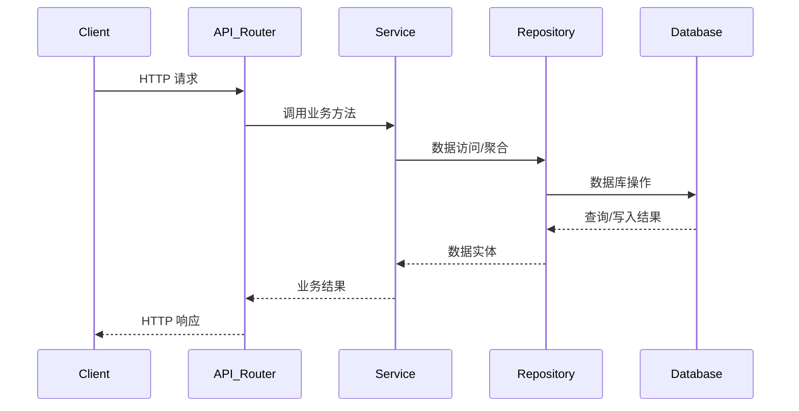

# Architecture Documentation

This directory contains comprehensive documentation related to the system architecture of the HeyTCM project.

## Directory Structure

```
architecture/
├── database/             # Database architecture and implementation
│   ├── schema/          # Database schema design
│   ├── clients/         # Database client implementations
│   └── sync/            # Data synchronization patterns
├── services/            # Service layer architecture
│   ├── core/           # Core service implementations
│   ├── api/            # API service implementations
│   └── auth/           # Authentication services
└── api/                 # API architecture
    ├── design/         # API design principles
    ├── endpoints/      # API endpoint documentation
    └── security/       # API security considerations
```

## Documentation Purpose

### Database Architecture
- Database schema design and implementation
- Client implementations for different environments
- Data synchronization patterns and strategies
- Migration and versioning approaches
- Performance optimization techniques
- Security considerations

### Service Layer
- Core service implementations and patterns
- API service architecture and design
- Authentication service implementations
- Service communication patterns
- Environment-aware service design
- Error handling strategies
- Testing methodologies

### API Architecture
- API design principles and best practices
- Endpoint documentation and specifications
- Security considerations and implementations
- Versioning and backward compatibility
- Rate limiting and throttling
- Documentation standards

## Key Features

### 1. Environment-Aware Design
- Automatic environment detection
- Seamless environment switching
- Consistent interfaces across environments
- Mock data support for development

### 2. Service Layer Architecture
- Adapter pattern implementation
- Service factory design
- Configuration management
- Error handling framework
- Testing infrastructure

### 3. Database Integration
- Multi-database support
- Offline-first capabilities
- Data synchronization
- Migration management
- Performance optimization

### 4. Security Implementation
- Authentication mechanisms
- Authorization controls
- Data encryption
- Input validation
- Output sanitization

## Usage Guidelines

1. **Getting Started**
   - Review the architecture overview
   - Understand the service layer design
   - Familiarize with database architecture
   - Study API design principles

2. **Development Process**
   - Follow service implementation guidelines
   - Adhere to API design standards
   - Implement proper error handling
   - Write comprehensive tests

3. **Best Practices**
   - Keep services focused and modular
   - Use consistent error handling
   - Implement proper logging
   - Follow security guidelines
   - Write maintainable code

4. **Testing Strategy**
   - Unit testing services
   - Integration testing
   - Environment-specific testing
   - Performance testing
   - Security testing

## Contributing

When adding new architecture documentation:

1. **Documentation Structure**
   - Place in appropriate subdirectory
   - Follow existing style guide
   - Include necessary diagrams
   - Update cross-references

2. **Content Guidelines**
   - Be clear and concise
   - Include code examples
   - Provide implementation details
   - Document best practices

3. **Review Process**
   - Technical review required
   - Architecture team approval
   - Update related documents
   - Version control updates

## 服务与 API Router 的关系

### 架构原则

- **服务（Service）层** 负责业务逻辑、数据聚合、权限校验、调用 Repository/数据库等，是系统的核心业务实现。
- **API Router 层** 只负责 HTTP 路由、请求参数校验、认证（如有）、调用 Service 并返回结果，不直接操作数据库或实现业务逻辑。

### 依赖与协作关系

1. **API Router 依赖 Service**：API 层通过调用 Service 层接口，实现业务功能暴露。
2. **Service 层解耦 API**：Service 层不依赖具体 API 路由实现，可被多种入口（如 Web、App、后台任务）复用。
3. **类型统一**：所有服务、API Router、Repository、数据库实体类型均通过 `src/core/lib/db/types/index.ts` 统一出口，避免类型漂移。
4. **Schema 变动流程**：当数据表结构/schema 发生变化时，需同步更新 Repository、Models、Types，所有服务和 API Router 只需通过统一类型入口 import，无需自行维护类型。

### 典型调用流程



### 示例代码片段

**API Router 示例**
```typescript
import { NextApiRequest, NextApiResponse } from 'next';
import { userService } from '@/core/services/user.service';

export default async function handler(req: NextApiRequest, res: NextApiResponse) {
  if (req.method === 'GET') {
    const users = await userService.getAllUsers();
    res.status(200).json(users);
  }
}
```

**Service 层示例**
```typescript
import { UserRepository } from '@/core/lib/db/repository';
import type { User } from '@/core/lib/db/types';

export class UserService {
  async getAllUsers(): Promise<User[]> {
    return UserRepository.findAll();
  }
}
```

> 这样实现分层解耦，便于维护、测试和扩展。所有类型变更只需在 types 层维护，所有服务和 API 层自动获得类型同步。

## Related Resources

- [Development Guidelines](../development/README.md)
- [Testing Documentation](../testing/README.md)
- [Security Guidelines](../security/README.md)
- [Deployment Documentation](../deployment/README.md) 