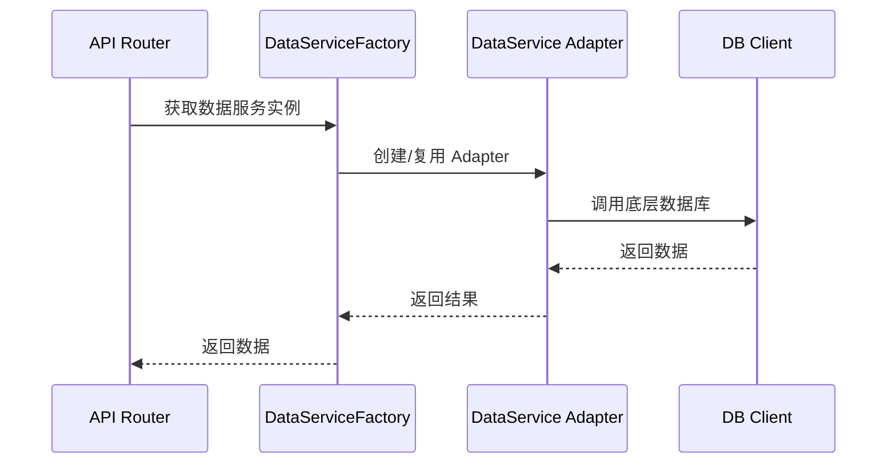

# HeyTCM 服务层设计

## 概述

服务层是 HeyTCM 的核心组件，采用适配器模式设计，实现了业务逻辑与具体实现的解耦。这种设计带来以下核心优势：

1. **统一的服务接口**
   - 所有环境（Mock、开发、生产）使用相同的服务接口
   - 页面层代码无需关心具体实现
   - 业务逻辑保持一致性

2. **无缝环境切换**
   - 通过配置即可切换不同环境
   - 无需修改代码，只需调整环境变量
   - 支持平滑迁移和回滚

3. **数据一致性**
   - 统一的测试数据格式
   - 支持跨环境数据复用
   - 简化测试数据管理

4. **开发效率**
   - 快速切换开发环境
   - 统一的开发体验
   - 减少环境配置工作

### 环境切换示例

```typescript
// 开发环境
bun run dev --env=mock

// 测试环境
bun run dev --env=firebase

// 生产环境
bun run dev --env=better
```

### 数据注入示例

```typescript
// 统一的测试数据格式
const testData = {
  users: [
    {
      id: '1',
      email: 'test@example.com',
      name: 'Test User'
    }
  ],
  // 其他测试数据
};

// 环境配置
{
  "environment": "development",
  "services": {
    "auth": {
      "type": "mock",
      "testData": testData  // 所有环境使用相同的数据格式
    }
  }
}
```

### 优势总结

1. **开发体验**
   - 统一的 API 调用方式
   - 无需修改业务代码
   - 快速环境切换

2. **维护成本**
   - 集中管理服务实现
   - 简化配置管理
   - 降低运维复杂度

3. **测试效率**
   - 统一的测试数据
   - 跨环境测试支持
   - 快速验证功能

4. **部署灵活**
   - 按需选择实现
   - 平滑迁移能力
   - 降低部署风险

## 架构设计

### 核心组件

1. **服务接口 (IService)**
   - 定义服务的基本行为
   - 包含初始化、释放和状态检查方法
   - 所有服务必须实现此接口

2. **服务适配器**
   - 实现特定服务的具体逻辑
   - 支持多种实现方式：
     - Mock 适配器：用于开发和测试
     - Firebase 适配器：用于测试环境
     - Better 适配器：用于生产环境
     - FakeIndexedDB 适配器：用于 mock 阶段，支持纯内存 mock 和离线/在线混合场景

3. **服务工厂**
   - 负责创建服务实例
   - 根据配置选择适当的适配器
   - 实现单例模式确保全局唯一实例

4. **服务注册表**
   - 管理服务提供者
   - 支持动态注册和注销
   - 提供服务发现功能

### 与 API Router 的关系

1. **API 路由层**
   - 位于 `app/api` 目录
   - 负责处理 HTTP 请求
   - 调用相应的服务方法
   - 返回 HTTP 响应

2. **服务调用流程**
   ```
   HTTP Request -> API Router -> Service Factory -> Service Adapter -> Database
   ```

3. **错误处理**
   - API 层捕获服务异常
   - 转换为适当的 HTTP 状态码
   - 返回标准化的错误响应

### 与数据库的关系

1. **数据库适配器**
   - 封装数据库访问逻辑
   - 支持多种数据库：
     - Mock 数据库：内存存储
     - Firebase：Firestore
     - Better：自定义数据库
     - FakeIndexedDB：支持纯内存 mock 和离线/在线混合场景

2. **数据转换**
   - 服务层负责数据格式转换
   - 确保数据一致性
   - 处理类型映射

## 数据服务架构与设计

### 统一的数据服务接口

数据服务层（Data Service）采用统一接口（`IDataService`），所有数据访问操作（包括 Mock、SQLite、Firebase 等）都通过该接口进行，保证了业务逻辑与底层数据实现的彻底解耦。

- **核心接口方法**：
  - `initialize(config)`：初始化服务
  - `connect()/disconnect()`：连接与断开数据库
  - `insert/update/delete/findById/findAll/clear`：标准 CRUD 操作
  - `batch/transaction`：批量与事务支持
  - `executeRawQuery`：原生查询能力（如支持）

### 分层架构

数据服务分为三层：

1. **Client 层**
   - 封装具体数据库驱动（如 SQLite、Firebase、Mock）
   - 只负责底层连接、原子操作、事务、底层数据格式
   - 典型文件：`src/core/lib/db/clients/{sqlite|firebase|mock}/*-client.ts`

2. **Service Adapter 层**
   - 组合 Client 实例，对外暴露统一接口
   - 负责业务层与 Client 层的解耦、参数适配、错误处理、日志
   - 典型文件：`src/core/services-update/data/adapters/{sqlite|firebase|mock}-data-service.ts`

3. **Factory/Registry 层**
   - 负责根据配置创建对应的 Service Adapter 实例
   - 支持多环境切换、单例管理
   - 典型文件：`src/core/services-update/data/factory/data-service-factory.ts`

### 适配器实现说明

- **SqliteDataService** 只组合 `SQLiteClient`，所有数据库操作委托给 Client。
- **FirebaseDataService** 只组合 `FirebaseClient`，所有数据库操作委托给 Client。
- **MockDataService** 只组合 `MockDatabaseClient`，所有数据库操作委托给 Client。
- **FakeIndexedDBDataService** 可组合 `FakeIndexedDBDatabaseClient`，支持纯内存 mock，也可作为离线/在线混合场景的中间层，完整支持 CRUD，便于无缝迁移到 IndexedDB（离线）和其他数据库（在线）。
- 未来可扩展更多数据源，只需实现对应 Client 与 Adapter。

### 主要优势

- **分层复用**：底层能力（如事务、批量、连接池）在 Client 层复用，业务无感知。
- **解耦维护**：业务层无需关心数据库细节，切换数据源只需更改配置。
- **类型安全**：统一接口与类型定义，减少类型错误。
- **易扩展**：新增数据源仅需实现 Client 与 Adapter，无需改动业务代码。

### 典型调用流程



### 配置与环境切换

- 通过配置文件或环境变量选择数据服务类型（mock/sqlite/firebase等）
- 工厂自动注入对应实现，支持热切换与多环境部署

### 示例

```typescript
const config = {
  environment: 'development',
  services: {
    data: {
      type: 'firebase',
      options: { /* firebase 配置 */ }
    }
  }
};
const dataService = DataServiceFactory.getInstance().createService(config);
await dataService.insert('users', { id: '1', name: '张三' });
```

## 环境切换

### 环境配置

1. **开发环境 (development)**
   - 使用 Mock 适配器
   - 内存存储数据
   - 快速开发和测试

2. **测试环境 (test)**
   - 使用 Firebase 适配器
   - 模拟真实环境
   - 进行集成测试

3. **生产环境 (production)**
   - 使用 Better 适配器
   - 真实数据库
   - 高可用性和性能

### 切换机制

1. **配置驱动**
   ```typescript
   {
     "environment": "development",
     "services": {
       "auth": {
         "type": "mock",
         "autoLogin": true
       },
       "user": {
         "type": "mock"
       },
       "data": {
         "type": "mock"
       }
     }
   }
   ```

2. **自动切换**
   - 根据环境变量选择适配器
   - 服务工厂负责实例化
   - 无需修改代码

## 服务管理

### 添加新服务

1. **定义服务接口**
   ```typescript
   export interface IMyService extends IService {
     // 服务方法
   }
   ```

2. **实现适配器**
   ```typescript
   export class MockMyService implements IMyService {
     // 实现方法
   }
   ```

3. **注册服务**
   ```typescript
   registry.registerProvider('mock', MockMyService);
   ```

### 更新现有服务

1. **版本控制**
   - 保持向后兼容
   - 使用语义化版本
   - 记录变更日志

2. **迁移策略**
   - 提供迁移工具
   - 支持数据转换
   - 确保平滑升级

3. **测试覆盖**
   - 单元测试
   - 集成测试
   - 性能测试

## 最佳实践

1. **服务设计**
   - 单一职责原则
   - 接口隔离原则
   - 依赖倒置原则

2. **错误处理**
   - 统一的错误类型
   - 详细的错误信息
   - 适当的日志记录

3. **性能优化**
   - 缓存策略
   - 批量操作
   - 异步处理

4. **安全性**
   - 输入验证
   - 权限控制
   - 数据加密

## 示例

### 创建服务实例

```typescript
const config: ServiceConfig = {
  environment: 'development',
  services: {
    auth: {
      type: 'mock',
      autoLogin: true
    }
  }
};

const factory = AuthServiceFactory.getInstance();
const service = factory.createService(config);
```

### 使用服务

```typescript
// API Router
export async function POST(req: Request) {
  const service = await getAuthService();
  const user = await service.signInWithEmail(email, password);
  return NextResponse.json(user);
}
```

## 注意事项

1. **配置管理**
   - 使用环境变量
   - 避免硬编码
   - 保护敏感信息

2. **资源管理**
   - 及时释放资源
   - 处理连接池
   - 监控资源使用

3. **日志记录**
   - 关键操作日志
   - 错误追踪
   - 性能监控

4. **测试策略**
   - 单元测试
   - 集成测试
   - 端到端测试

## 文件夹结构

```
src/core/services-update/
├── infrastructure/           # 基础设施服务
│   ├── factory/             # 服务工厂
│   │   ├── base-factory.ts  # 基础工厂类
│   │   └── service-factory.ts
│   ├── registry/            # 服务注册表
│   │   ├── base-registry.ts # 基础注册表
│   │   └── service-registry.ts
│   ├── providers/           # 基础服务提供者
│   │   ├── network/         # 网络服务
│   │   └── logger/          # 日志服务
│   └── types.ts             # 基础设施类型定义
│
├── business/                # 业务服务
│   ├── auth/               # 认证服务
│   │   ├── adapters/      # 认证适配器
│   │   │   ├── better/    # Better 认证
│   │   │   ├── firebase/  # Firebase 认证
│   │   │   ├── mock/      # Mock 认证
│   │   │   └── nextauth/  # NextAuth 适配器
│   │   ├── factory/       # 认证服务工厂
│   │   ├── registry/      # 认证服务注册表
│   │   └── types/         # 认证服务类型
│   │
│   ├── user/              # 用户服务
│   │   ├── adapters/     
│   │   │   ├── mock/      # Mock 适配器
│   │   │   ├── firebase/  # Firebase 适配器
│   │   │   └── better/    # Better 适配器
│   │   ├── factory/      
│   │   ├── registry/     
│   │   └── types/        
│   │
│   ├── message/          # 消息服务 [TBD]
│   │   ├── adapters/     
│   │   │   ├── firebase/  # Firebase 适配器
│   │   │   ├── pusher/    # Pusher 适配器
│   │   │   └── sendbird/  # SendBird 适配器
│   │   ├── factory/      
│   │   ├── registry/     
│   │   └── types/        
│   │
│   ├── payment/          # 支付服务 [TBD]
│   │   ├── adapters/     
│   │   │   ├── stripe/    # Stripe 适配器
│   │   │   ├── paypal/    # PayPal 适配器
│   │   │   ├── polar/     # Polar.sh 适配器
│   │   │   ├── lemon/     # LemonSqueezy 适配器
│   │   │   ├── creem/     # Creem 适配器
│   │   │   ├── google/    # Google Play 适配器
│   │   │   └── apple/     # Apple IAP 适配器
│   │   ├── factory/      
│   │   ├── registry/     
│   │   └── types/        
│   │
│   ├── sync/            # 同步服务 [TBD]
│   │   ├── adapters/    # 同步适配器
│   │   ├── factory/     # 同步服务工厂
│   │   ├── registry/    # 同步服务注册表
│   │   └── types/       # 同步服务类型
│   │
│   ├── test/            # 测试服务 [TBD]
│   │   ├── adapters/    # 测试适配器
│   │   ├── factory/     # 测试服务工厂
│   │   ├── registry/    # 测试服务注册表
│   │   └── types/       # 测试服务类型
│   │
│   ├── advertising/     # 广告服务 [TBD]
│   │   ├── adapters/    
│   │   │   ├── admob/   # AdMob 适配器
│   │   │   ├── unity/   # Unity Ads 适配器
│   │   │   ├── applovin/# AppLovin 适配器
│   │   │   ├── ironsource/ # IronSource 适配器
│   │   │   ├── vungle/  # Vungle 适配器
│   │   │   └── chartboost/ # Chartboost 适配器
│   │   ├── factory/     
│   │   ├── registry/    
│   │   └── types/       
│   │
│   ├── analytics/       # 分析服务 [TBD]
│   │   ├── adapters/    
│   │   │   ├── google/  # Google Analytics 适配器
│   │   │   ├── mixpanel/# Mixpanel 适配器
│   │   │   ├── amplitude/ # Amplitude 适配器
│   │   │   ├── sentry/  # Sentry 适配器
│   │   │   └── newrelic/ # New Relic 适配器
│   │   ├── factory/     
│   │   ├── registry/    
│   │   └── types/       
│   │
│   ├── search/          # 搜索服务 [TBD]
│   │   ├── adapters/    
│   │   │   ├── algolia/ # Algolia 适配器
│   │   │   ├── elastic/ # Elasticsearch 适配器
│   │   │   └── sqlite/  # SQLite FTS 适配器
│   │   ├── factory/     
│   │   ├── registry/    
│   │   └── types/       
│   │
│   ├── map/             # 地图服务 [TBD]
│   │   ├── adapters/    
│   │   │   ├── google/  # Google Maps 适配器
│   │   │   ├── mapbox/  # Mapbox 适配器
│   │   │   └── geolocation/ # Geolocation API 适配器
│   │   ├── factory/     
│   │   ├── registry/    
│   │   └── types/       
│   │
│   ├── social/          # 社交服务 [TBD]
│   │   ├── adapters/    
│   │   │   ├── share/   # Share API 适配器
│   │   │   ├── facebook/ # Facebook SDK 适配器
│   │   │   └── twitter/ # Twitter API 适配器
│   │   ├── factory/     
│   │   ├── registry/    
│   │   └── types/       
│   │
│   ├── media/           # 媒体服务 [TBD]
│   │   ├── adapters/    
│   │   │   ├── audio/   # Web Audio API 适配器
│   │   │   ├── video/   # Video API 适配器
│   │   │   └── webrtc/  # WebRTC 适配器
│   │   ├── factory/     
│   │   ├── registry/    
│   │   └── types/       
│   │
│   ├── device/          # 设备服务 [TBD]
│   │   ├── adapters/    
│   │   │   ├── sensor/  # 传感器适配器
│   │   │   │   ├── motion/      # 运动传感器
│   │   │   │   │   ├── accelerometer.ts    # 加速度计
│   │   │   │   │   ├── gyroscope.ts        # 陀螺仪
│   │   │   │   │   └── orientation.ts      # 方向传感器
│   │   │   │   ├── environment/ # 环境传感器
│   │   │   │   │   ├── ambient-light.ts    # 环境光
│   │   │   │   │   ├── temperature.ts      # 温度
│   │   │   │   │   └── humidity.ts         # 湿度
│   │   │   │   └── health/      # 健康传感器
│   │   │   │       ├── heart-rate.ts       # 心率
│   │   │   │       ├── pedometer.ts        # 计步器
│   │   │   │       └── sleep.ts            # 睡眠监测
│   │   │   ├── bluetooth/       # 蓝牙适配器
│   │   │   │   ├── smart-watch/ # 智能手表
│   │   │   │   │   ├── apple-watch.ts      # Apple Watch
│   │   │   │   │   ├── galaxy-watch.ts     # Galaxy Watch
│   │   │   │   │   └── fitbit.ts           # Fitbit
│   │   │   │   ├── health-monitor/ # 健康监测设备
│   │   │   │   │   ├── blood-pressure.ts   # 血压计
│   │   │   │   │   ├── glucose-meter.ts    # 血糖仪
│   │   │   │   │   └── oximeter.ts         # 血氧仪
│   │   │   │   └── fitness/     # 健身设备
│   │   │   │       ├── treadmill.ts        # 跑步机
│   │   │   │       ├── bike.ts             # 动感单车
│   │   │   │       └── scale.ts            # 智能体重秤
│   │   │   └── network/         # 网络设备适配器
│   │   │       ├── cellular/    # 蜂窝网络设备
│   │   │       │   ├── smart-band.ts       # 智能手环
│   │   │       │   ├── smart-clothing.ts   # 智能服装
│   │   │       │   └── medical-device.ts   # 医疗设备
│   │   │       └── wifi/        # WiFi设备
│   │   │           ├── smart-scale.ts      # 智能体重秤
│   │   │           ├── smart-pillbox.ts    # 智能药盒
│   │   │           └── smart-thermometer.ts # 智能体温计
│   │   ├── factory/     
│   │   ├── registry/    
│   │   └── types/       
│   │
│   └── security/        # 安全服务 [TBD]
│       ├── adapters/    
│       │   ├── crypto/  # 加密适配器
│       │   ├── webauthn/ # WebAuthn 适配器
│       │   └── oauth/   # OAuth 适配器
│       ├── factory/     
│       ├── registry/    
│       └── types/       
│
├── data/                  # 数据服务
│   ├── adapters/         # 数据适配器
│   │   ├── firebase/     # Firebase 数据库
│   │   ├── fakeindexedb/         # FakeIndexedDB 数据库
│   │   ├── drizzle/      # Drizzle 适配器
│   │   ├── indexeddb/    # IndexedDB 适配器
│   │   └── sqlite/       # SQLite 适配器
│   ├── factory/          # 数据服务工厂
│   ├── registry/         # 数据服务注册表
│   └── types.ts          # 数据服务类型定义
│
└── utils/                 # 工具函数
    ├── logger.ts         # 日志工具
    ├── error.ts          # 错误处理
    └── validation.ts     # 数据验证

### 目录说明

1. **基础设施服务**
   - 提供基础的服务工厂和注册表实现
   - 包含网络、日志等基础设施服务
   - 存储服务已移至数据服务层

2. **业务服务**
   - 已实现服务：
     - auth/: 认证服务
     - user/: 用户服务
   - 待开发服务 [TBD]：
     - message/: 消息服务
     - payment/: 支付服务
     - sync/: 同步服务
     - test/: 测试服务
     - advertising/: 广告服务
     - analytics/: 分析服务
     - search/: 搜索服务
     - map/: 地图服务
     - social/: 社交服务
     - media/: 媒体服务
     - device/: 设备服务
     - security/: 安全服务

3. **数据服务**
   - 负责数据存储和访问
   - 提供统一的数据库接口
   - 支持多种数据库适配器：
     - Better 数据库
     - Firebase 数据库
     - FakeIndexedDB 数据库
     - Drizzle 适配器
     - IndexedDB 适配器
     - SQLite 适配器

4. **工具函数**
   - 提供通用的工具函数
   - 包括日志、错误处理、数据验证等

### 文件命名规范

1. **接口文件**
   - 以 `I` 开头，如 `IService`
   - 使用 PascalCase
   - 放在 `types` 目录

2. **实现文件**
   - 使用 PascalCase
   - 包含实现类型，如 `MockAuthService`
   - 放在对应的适配器目录

3. **工厂和注册表**
   - 以 `Factory` 或 `Registry` 结尾
   - 使用 PascalCase
   - 放在对应的目录

4. **配置文件**
   - 使用 kebab-case
   - 以 `.config.ts` 结尾
   - 放在服务根目录

### 代码组织原则

1. **模块化**
   - 每个服务独立模块
   - 清晰的依赖关系
   - 最小化耦合

2. **可扩展性**
   - 易于添加新服务
   - 支持新适配器
   - 灵活的配置

3. **可维护性**
   - 一致的代码风格
   - 完整的文档
   - 清晰的注释

4. **可测试性**
   - 单元测试友好
   - 依赖注入支持
   - 模拟数据支持

## 服务扩展指南

### 认证服务扩展

#### 添加新的认证提供者（以 NextAuth 为例）

1. **创建适配器**
   ```typescript
   // src/core/services-update/business/auth/adapters/nextauth/nextauth-auth-service.ts
   import { IAuthService } from '../../types/auth-service';
   import { ServiceConfig } from '../../../types/config';
   import { User } from '@/core/lib/db/types/user';
   import { AuthSession } from '../../types/auth-service';
   import { NextAuth } from 'next-auth';

   export class NextAuthAuthService implements IAuthService {
     private auth: NextAuth;
     private initialized: boolean = false;

     constructor(private config: ServiceConfig) {
       this.auth = new NextAuth({
         providers: [
           // 配置提供者
         ],
         // 其他配置
       });
     }

     // 实现接口方法
   }
   ```

2. **注册提供者**
   ```typescript
   // src/core/services-update/business/auth/registry/auth-registry.ts
   import { NextAuthAuthService } from '../adapters/nextauth/nextauth-auth-service';

   export class AuthServiceRegistry extends BaseServiceRegistry<IAuthService> {
     private constructor() {
       super();
       // 注册现有提供者
       this.registerProvider('nextauth', NextAuthAuthService);
     }
   }
   ```

3. **更新配置类型**
   ```typescript
   // src/core/services-update/business/auth/types/config.ts
   export interface AuthConfig {
     type: 'mock' | 'firebase' | 'better' | 'nextauth' | 'clerk';
     // NextAuth 特定配置
     nextauth?: {
       providers: Provider[];
       secret: string;
       // 其他配置
     };
     // Clerk 特定配置
     clerk?: {
       publishableKey: string;
       secretKey: string;
       // 其他配置
     };
   }
   ```

#### 添加 Clerk 认证服务

1. **创建适配器**
   ```typescript
   // src/core/services-update/business/auth/adapters/clerk/clerk-auth-service.ts
   import { Clerk } from '@clerk/backend';

   export class ClerkAuthService implements IAuthService {
     private clerk: Clerk;
     
     constructor(private config: ServiceConfig) {
       this.clerk = new Clerk({
         publishableKey: config.auth?.clerk?.publishableKey,
         secretKey: config.auth?.clerk?.secretKey
       });
     }

     // 实现接口方法
   }
   ```

### 数据服务扩展

#### 添加离线在线混合存储

1. **创建混合存储适配器**
   ```typescript
   // src/core/services-update/data/adapters/hybrid/hybrid-data-service.ts
   export class HybridDataService implements IDataService {
     private onlineDb: any;
     private offlineDb: any;
     private syncManager: SyncManager;

     constructor(private config: ServiceConfig) {
       // 初始化在线数据库（如 PostgreSQL）
       this.onlineDb = new PostgresDB(config.data?.postgres);
       
       // 初始化离线数据库（如 SQLite）
       this.offlineDb = new SQLiteDB(config.data?.sqlite);
       
       // 初始化同步管理器
       this.syncManager = new SyncManager({
         onlineDb: this.onlineDb,
         offlineDb: this.offlineDb,
         syncStrategy: config.data?.syncStrategy
       });
     }

     // 实现数据操作，处理离线在线同步
   }
   ```

2. **同步策略配置**
   ```typescript
   // src/core/services-update/data/types/config.ts
   export interface DataConfig {
     type: 'mock' | 'firebase' | 'better' | 'hybrid';
     // 混合存储配置
     hybrid?: {
       online: {
         type: 'postgres' | 'mysql' | 'mongodb';
         config: DatabaseConfig;
       };
       offline: {
         type: 'sqlite' | 'indexeddb' | 'localstorage';
         config: DatabaseConfig;
       };
       sync: {
         strategy: 'immediate' | 'periodic' | 'manual';
         interval?: number;
         conflictResolution?: 'server' | 'client' | 'custom';
       };
     };
   }
   ```

3. **同步管理器实现**
   ```typescript
   // src/core/services-update/business/sync/sync-manager.ts
   export class SyncManager {
     constructor(private config: SyncConfig) {}

     async sync() {
       // 实现同步逻辑
       // 1. 检测网络状态
       // 2. 处理冲突
       // 3. 同步数据
     }

     async resolveConflict(local: any, remote: any) {
       // 实现冲突解决策略
     }
   }
   ```

### 环境特定配置

#### 开发环境
```typescript
{
  "environment": "development",
  "services": {
    "auth": {
      "type": "mock",
      "autoLogin": true
    },
    "data": {
      "type": "hybrid",
      "hybrid": {
        "online": {
          "type": "postgres",
          "config": {
            "url": "postgres://localhost:5432/dev"
          }
        },
        "offline": {
          "type": "sqlite",
          "config": {
            "path": "./dev.db"
          }
        },
        "sync": {
          "strategy": "immediate"
        }
      }
    }
  }
}
```

#### 生产环境
```typescript
{
  "environment": "production",
  "services": {
    "auth": {
      "type": "clerk",
      "clerk": {
        "publishableKey": "...",
        "secretKey": "..."
      }
    },
    "data": {
      "type": "hybrid",
      "hybrid": {
        "online": {
          "type": "postgres",
          "config": {
            "url": "postgres://prod:5432/prod"
          }
        },
        "offline": {
          "type": "indexeddb",
          "config": {
            "name": "prod-db"
          }
        },
        "sync": {
          "strategy": "periodic",
          "interval": 300000
        }
      }
    }
  }
}
```

### 扩展建议

1. **认证服务扩展**
   - 保持接口一致性
   - 实现必要的转换方法
   - 处理提供者特定的错误
   - 添加适当的日志记录

2. **数据服务扩展**
   - 设计清晰的同步策略
   - 实现可靠的冲突解决
   - 考虑性能优化
   - 添加数据验证

3. **配置管理**
   - 使用环境变量
   - 支持动态配置
   - 提供默认值
   - 验证配置有效性

4. **测试策略**
   - 单元测试适配器
   - 集成测试同步
   - 性能测试
   - 离线场景测试

## 存储方案

### 离线存储方案

1. **浏览器内置存储**
   - **IndexedDB**
     - 支持结构化数据存储
     - 异步操作
     - 支持事务
     - 适合复杂数据
   - **LocalStorage**
     - 简单的键值存储
     - 同步操作
     - 容量有限
     - 适合简单配置
   - **SessionStorage**
     - 会话级存储
     - 页面关闭后清除
     - 适合临时数据

2. **移动端存储**
   - **Capacitor SQLite**
     - 完整的 SQL 支持
     - 高性能
     - 支持加密
     - 适合复杂业务
   - **Capacitor Filesystem**
     - 文件系统访问
     - 适合大文件
     - 支持目录操作

3. **混合存储策略**
   ```typescript
   interface StorageConfig {
     type: 'indexeddb' | 'sqlite' | 'filesystem';
     options: {
       name: string;
       version?: number;
       encryption?: boolean;
       // 其他配置
     };
   }
   ```

### 在线存储方案

1. **关系型数据库**
   - **PostgreSQL**
     - 通过 Drizzle ORM 支持
     - 完整的事务支持
     - 强大的查询能力
   - **MySQL**
     - 通过 Drizzle ORM 支持
     - 高性能
     - 广泛使用
   - **SQLite**
     - 通过 Drizzle ORM 支持
     - 轻量级
     - 适合小型应用

2. **NoSQL 数据库**
   - **MongoDB**
     - 文档存储
     - 灵活的模式
     - 适合非结构化数据
   - **Firestore**
     - 实时同步
     - 自动扩展
     - 适合实时应用

3. **云存储服务**
   - **Supabase**
     - PostgreSQL 托管
     - 实时订阅
     - 身份认证
   - **Turso**
     - 分布式 SQLite
     - 边缘计算
     - 低延迟

### 存储策略配置

1. **纯在线模式**
   ```typescript
   {
     "storage": {
       "type": "online",
       "online": {
         "type": "postgres",
         "config": {
           "url": "postgres://..."
         }
       }
     }
   }
   ```

2. **离线优先模式**
   ```typescript
   {
     "storage": {
       "type": "hybrid",
       "offline": {
         "type": "indexeddb",
         "config": {
           "name": "app-db",
           "version": 1
         }
       },
       "online": {
         "type": "postgres",
         "config": {
           "url": "postgres://..."
         }
       },
       "sync": {
         "strategy": "periodic",
         "interval": 300000
       }
     }
   }
   ```

3. **移动端离线模式**
   ```typescript
   {
     "storage": {
       "type": "hybrid",
       "offline": {
         "type": "sqlite",
         "config": {
           "name": "app.db",
           "location": "default",
           "encryption": true
         }
       },
       "online": {
         "type": "postgres",
         "config": {
           "url": "postgres://..."
         }
       }
     }
   }
   ```

### 存储适配器实现

1. **IndexedDB 适配器**
   ```typescript
   export class IndexedDBAdapter implements IStorageAdapter {
     private db: IDBDatabase;
     
     constructor(private config: StorageConfig) {
       this.initDB();
     }

     private async initDB() {
       // 初始化 IndexedDB
     }

     // 实现存储接口
   }
   ```

2. **SQLite 适配器**
   ```typescript
   export class SQLiteAdapter implements IStorageAdapter {
     private db: SQLiteDB;
     
     constructor(private config: StorageConfig) {
       this.initDB();
     }

     private async initDB() {
       // 初始化 SQLite
     }

     // 实现存储接口
   }
   ```

3. **Drizzle 适配器**
   ```typescript
   export class DrizzleAdapter implements IStorageAdapter {
     private db: DrizzleClient;
     
     constructor(private config: StorageConfig) {
       this.initDB();
     }

     private async initDB() {
       // 初始化 Drizzle
     }

     // 实现存储接口
   }
   ```

### 存储选择建议

1. **Web 应用**
   - 简单应用：LocalStorage
   - 中等复杂度：IndexedDB
   - 复杂应用：混合存储

2. **移动应用**
   - 简单应用：Capacitor Filesystem
   - 中等复杂度：Capacitor SQLite
   - 复杂应用：混合存储

3. **跨平台应用**
   - 统一接口
   - 平台特定实现
   - 混合策略

## 认证服务方案

### 认证提供者

1. **云服务认证**
   - **Better Auth**
     - 自定义认证服务
     - 完整控制权
     - 适合企业级应用
   - **Firebase Auth**
     - Google 提供
     - 多种登录方式
     - 实时同步
   - **Clerk**
     - 开发者友好
     - 丰富的 UI 组件
     - 企业级功能
   - **NextAuth.js**
     - 开源解决方案
     - 支持多种提供者
     - 高度可定制

2. **游戏服务认证**
   - **Xsolla Login**
     - 游戏专用 SDK
     - 支付集成
     - 社交功能
   - **PlayFab**
     - 微软游戏服务
     - 玩家数据管理
     - 排行榜系统
   - **GameSparks**
     - 实时游戏服务
     - 多人游戏支持
     - 游戏分析

3. **企业认证**
   - **Auth0**
     - 企业级安全
     - 单点登录
     - 合规认证
   - **Okta**
     - 身份管理
     - 访问控制
     - 安全策略
   - **Keycloak**
     - 开源解决方案
     - 自定义主题
     - 多租户支持

### 认证配置示例

1. **游戏服务认证**
   ```typescript
   {
     "auth": {
       "type": "xsolla",
       "xsolla": {
         "projectId": "your-project-id",
         "loginId": "your-login-id",
         "secretKey": "your-secret-key",
         "features": {
           "socialLogin": true,
           "payment": true,
           "analytics": true
         }
       }
     }
   }
   ```

2. **企业认证**
   ```typescript
   {
     "auth": {
       "type": "auth0",
       "auth0": {
         "domain": "your-domain.auth0.com",
         "clientId": "your-client-id",
         "clientSecret": "your-client-secret",
         "enterprise": {
           "sso": true,
           "mfa": true,
           "compliance": ["GDPR", "HIPAA"]
         }
       }
     }
   }
   ```

### 认证适配器实现

1. **Xsolla 适配器**
   ```typescript
   export class XsollaAuthService implements IAuthService {
     private xsolla: XsollaLogin;
     
     constructor(private config: ServiceConfig) {
       this.xsolla = new XsollaLogin({
         projectId: config.auth?.xsolla?.projectId,
         loginId: config.auth?.xsolla?.loginId,
         secretKey: config.auth?.xsolla?.secretKey
       });
     }

     async signInWithSocial(provider: string) {
       // 实现社交登录
     }

     async getPlayerData() {
       // 获取玩家数据
     }

     // 其他游戏相关方法
   }
   ```

2. **Auth0 适配器**
   ```typescript
   export class Auth0AuthService implements IAuthService {
     private auth0: Auth0Client;
     
     constructor(private config: ServiceConfig) {
       this.auth0 = new Auth0Client({
         domain: config.auth?.auth0?.domain,
         clientId: config.auth?.auth0?.clientId,
         clientSecret: config.auth?.auth0?.clientSecret
       });
     }

     async signInWithSSO() {
       // 实现单点登录
     }

     async enforceMFA() {
       // 实施多因素认证
     }

     // 其他企业认证方法
   }
   ```

### 认证选择建议

1. **游戏应用**
   - 简单游戏：Better Auth
   - 社交游戏：Xsolla Login
   - 大型游戏：PlayFab

2. **企业应用**
   - 中小型企业：Auth0
   - 大型企业：Okta
   - 定制需求：Keycloak

3. **通用应用**
   - 快速开发：Clerk
   - 开源优先：NextAuth.js
   - Google 生态：Firebase Auth

### 认证扩展建议

1. **游戏服务集成**
   - 考虑游戏特定功能
   - 集成支付系统
   - 支持社交功能
   - 处理玩家数据

2. **企业服务集成**
   - 支持单点登录
   - 实施安全策略
   - 确保合规性
   - 管理用户权限

3. **通用服务集成**
   - 保持接口一致性
   - 处理提供者差异
   - 实现必要转换
   - 添加适当日志

## App 开发服务设计建议

### 1. 平台适配

1. **设备能力检测**
   ```typescript
   interface DeviceCapabilities {
     platform: 'web' | 'ios' | 'android';
     storage: {
       type: 'indexeddb' | 'sqlite' | 'filesystem';
       available: boolean;
     };
     network: {
       type: 'wifi' | 'cellular' | 'offline';
       speed: number;
     };
   }
   ```

2. **平台特定实现**
   ```typescript
   export class PlatformService {
     async getStorageAdapter(): Promise<IStorageAdapter> {
       const capabilities = await this.getDeviceCapabilities();
       switch (capabilities.platform) {
         case 'web':
           return new IndexedDBAdapter();
         case 'ios':
         case 'android':
           return new SQLiteAdapter();
         default:
           throw new Error('Unsupported platform');
       }
     }
   }
   ```

### 2. 离线优先设计

1. **数据同步策略**
   ```typescript
   interface SyncStrategy {
     mode: 'immediate' | 'periodic' | 'manual';
     priority: 'offline' | 'online';
     conflictResolution: 'server' | 'client' | 'custom';
     retryPolicy: {
       maxAttempts: number;
       backoff: 'linear' | 'exponential';
     };
   }
   ```

2. **状态管理**
   ```typescript
   interface AppState {
     network: {
       status: 'online' | 'offline';
       lastSync: Date;
     };
     storage: {
       type: string;
       size: number;
       available: number;
     };
     sync: {
       queue: SyncItem[];
       status: 'idle' | 'syncing' | 'error';
     };
   }
   ```

### 3. 性能优化

1. **缓存策略**
   ```typescript
   interface CacheConfig {
     strategy: 'memory' | 'disk' | 'hybrid';
     ttl: number;
     maxSize: number;
     priority: 'performance' | 'storage' | 'balanced';
   }
   ```

2. **资源管理**
   ```typescript
   interface ResourceManager {
     async preloadResources(): Promise<void>;
     async releaseResources(): Promise<void>;
     async monitorUsage(): Promise<ResourceUsage>;
   }
   ```

### 4. 安全考虑

1. **数据加密**
   ```typescript
   interface EncryptionConfig {
     algorithm: 'aes' | 'rsa';
     keyStorage: 'secure' | 'keychain';
     autoEncrypt: boolean;
   }
   ```

2. **权限控制**
   ```typescript
   interface PermissionManager {
     async checkPermission(type: string): Promise<boolean>;
     async requestPermission(type: string): Promise<boolean>;
     async revokePermission(type: string): Promise<void>;
   }
   ```

### 5. 错误处理

1. **错误分类**
   ```typescript
   enum AppErrorType {
     NETWORK = 'network',
     STORAGE = 'storage',
     AUTH = 'auth',
     SYNC = 'sync',
     PLATFORM = 'platform'
   }
   ```

2. **错误恢复**
   ```typescript
   interface ErrorRecovery {
     async handleError(error: AppError): Promise<void>;
     async retryOperation(operation: () => Promise<void>): Promise<void>;
     async fallbackToOffline(): Promise<void>;
   }
   ```

### 6. 监控和日志

1. **性能监控**
   ```typescript
   interface PerformanceMonitor {
     async trackMetric(name: string, value: number): Promise<void>;
     async trackEvent(name: string, data: any): Promise<void>;
     async reportError(error: Error): Promise<void>;
   }
   ```

2. **用户行为分析**
   ```typescript
   interface AnalyticsService {
     async trackPageView(page: string): Promise<void>;
     async trackUserAction(action: string, data: any): Promise<void>;
     async trackError(error: Error): Promise<void>;
   }
   ```

### 7. 测试策略

1. **平台测试**
   ```typescript
   interface PlatformTest {
     async testStorage(): Promise<TestResult>;
     async testNetwork(): Promise<TestResult>;
     async testPermissions(): Promise<TestResult>;
   }
   ```

2. **离线场景测试**
   ```typescript
   interface OfflineTest {
     async testSync(): Promise<TestResult>;
     async testConflictResolution(): Promise<TestResult>;
     async testDataPersistence(): Promise<TestResult>;
   }
   ```

## 支付服务方案

### 支付提供者

1. **Web 支付服务**
   - **Stripe**
     - 全球支付处理
     - 订阅管理
     - 多种支付方式
   - **PayPal**
     - 广泛接受
     - 简单集成
     - 国际支付
   - **Polar.sh**
     - 开源项目赞助
     - GitHub 集成
     - 订阅管理
   - **LemonSqueezy**
     - 数字产品销售
     - 订阅管理
     - 会员系统
   - **Creem**
     - 创作者经济
     - 内容付费
     - 社区支持

2. **App 内购服务**
   - **Google Play Billing**
     - Android 应用内购
     - 订阅管理
     - 商品管理
   - **Apple In-App Purchase**
     - iOS 应用内购
     - 订阅管理
     - 商品管理

### 支付配置示例

1. **Web 支付配置**
   ```typescript
   {
     "payment": {
       "type": "stripe",
       "stripe": {
         "publishableKey": "pk_...",
         "secretKey": "sk_...",
         "webhookSecret": "whsec_...",
         "features": {
           "subscriptions": true,
           "oneTimePayments": true,
           "refunds": true
         }
       }
     }
   }
   ```

2. **App 内购配置**
   ```typescript
   {
     "payment": {
       "type": "hybrid",
       "google": {
         "serviceAccount": "path/to/service-account.json",
         "products": ["premium", "pro"]
       },
       "apple": {
         "sharedSecret": "your-shared-secret",
         "products": ["premium", "pro"]
       }
     }
   }
   ```

### 支付适配器实现

1. **Stripe 适配器**
   ```typescript
   export class StripePaymentService implements IPaymentService {
     private stripe: Stripe;
     
     constructor(private config: ServiceConfig) {
       this.stripe = new Stripe(config.payment?.stripe?.secretKey);
     }

     async createPaymentIntent(amount: number, currency: string) {
       // 创建支付意图
     }

     async handleWebhook(event: Stripe.Event) {
       // 处理 webhook 事件
     }

     // 其他支付方法
   }
   ```

2. **App 内购适配器**
   ```typescript
   export class InAppPurchaseService implements IPaymentService {
     private platform: 'ios' | 'android';
     
     constructor(private config: ServiceConfig) {
       this.platform = this.detectPlatform();
     }

     async purchaseProduct(productId: string) {
       if (this.platform === 'ios') {
         // 处理 Apple 内购
       } else {
         // 处理 Google 内购
       }
     }

     async restorePurchases() {
       // 恢复购买
     }
   }
   ```

## 推送服务方案

### 推送提供者

1. **Web 推送**
   - **Firebase Cloud Messaging**
     - 跨平台支持
     - 实时推送
     - 分析集成
   - **OneSignal**
     - 简单集成
     - 用户细分
     - A/B 测试

2. **App 推送**
   - **Apple Push Notification**
     - iOS 原生推送
     - 后台通知
     - 静默推送
   - **Google Cloud Messaging**
     - Android 原生推送
     - 高优先级消息
     - 数据消息

### 推送配置示例

```typescript
{
  "push": {
    "type": "hybrid",
    "web": {
      "type": "firebase",
      "config": {
        "apiKey": "...",
        "projectId": "...",
        "messagingSenderId": "..."
      }
    },
    "app": {
      "ios": {
        "certificate": "path/to/cert.p12",
        "passphrase": "..."
      },
      "android": {
        "serverKey": "..."
      }
    }
  }
}
```

## 消息服务方案

### 消息提供者

1. **实时消息**
   - **Firebase Realtime Database**
     - 实时同步
     - 离线支持
     - 简单集成
   - **Pusher**
     - 实时事件
     - 频道管理
     - WebSocket 支持

2. **聊天服务**
   - **SendBird**
     - 完整聊天功能
     - 用户管理
     - 文件共享
   - **Stream Chat**
     - 可定制 UI
     - 消息历史
     - 用户状态

### 消息配置示例

```typescript
{
  "messaging": {
    "type": "hybrid",
    "realtime": {
      "type": "firebase",
      "config": {
        "apiKey": "...",
        "projectId": "..."
      }
    },
    "chat": {
      "type": "sendbird",
      "config": {
        "appId": "...",
        "apiToken": "..."
      }
    }
  }
}
```

### 服务集成建议

1. **支付服务集成**
   - 统一支付接口
   - 处理支付状态
   - 管理订阅
   - 处理退款

2. **推送服务集成**
   - 统一推送接口
   - 处理设备令牌
   - 用户细分
   - 消息模板

3. **消息服务集成**
   - 统一消息接口
   - 处理实时事件
   - 管理用户状态
   - 处理离线消息

### 服务选择建议

1. **Web 应用**
   - 支付：Stripe/PayPal
   - 推送：Firebase/OneSignal
   - 消息：Firebase/Pusher

2. **移动应用**
   - 支付：App 内购
   - 推送：原生推送
   - 消息：SendBird/Stream

3. **跨平台应用**
   - 统一接口
   - 平台特定实现
   - 混合策略

## 其他常用服务方案

### 1. 分析服务

1. **用户行为分析**
   - **Google Analytics**
     - 用户行为追踪
     - 转化分析
     - 自定义事件
   - **Mixpanel**
     - 用户画像
     - 漏斗分析
     - A/B 测试
   - **Amplitude**
     - 产品分析
     - 用户留存
     - 行为预测

2. **性能监控**
   - **Sentry**
     - 错误追踪
     - 性能监控
     - 用户反馈
   - **New Relic**
     - 应用性能
     - 服务器监控
     - 用户体验

### 2. 存储服务

1. **文件存储**
   - **AWS S3**
     - 对象存储
     - CDN 集成
     - 版本控制
   - **Cloudinary**
     - 图片处理
     - 视频转码
     - 媒体管理
   - **Firebase Storage**
     - 实时同步
     - 安全规则
     - 离线支持

2. **缓存服务**
   - **Redis**
     - 内存缓存
     - 会话管理
     - 消息队列
   - **Memcached**
     - 分布式缓存
     - 简单高效
     - 水平扩展

### 3. 搜索服务

1. **全文搜索**
   - **Algolia**
     - 实时搜索
     - 模糊匹配
     - 多语言支持
   - **Elasticsearch**
     - 分布式搜索
     - 数据分析
     - 日志分析

2. **本地搜索**
   - **SQLite FTS**
     - 本地全文搜索
     - 离线支持
     - 轻量级

### 4. 地图服务

1. **地图服务**
   - **Google Maps**
     - 地图显示
     - 路线规划
     - 地点搜索
   - **Mapbox**
     - 自定义地图
     - 离线地图
     - 3D 支持

2. **位置服务**
   - **Geolocation API**
     - 位置获取
     - 地理围栏
     - 位置追踪

### 5. 社交服务

1. **社交分享**
   - **Share API**
     - 原生分享
     - 跨平台支持
     - 自定义分享
   - **Social Media SDKs**
     - 社交登录
     - 内容分享
     - 社交分析

2. **社交集成**
   - **Facebook SDK**
     - 社交登录
     - 好友邀请
     - 社交分享
   - **Twitter API**
     - 推文分享
     - 用户认证
     - 趋势分析

### 6. 媒体服务

1. **音频服务**
   - **Web Audio API**
     - 音频处理
     - 音效控制
     - 音频分析
   - **Audio Worklet**
     - 音频处理
     - 实时效果
     - 低延迟

2. **视频服务**
   - **Video API**
     - 视频播放
     - 流媒体
     - 视频处理
   - **WebRTC**
     - 实时通信
     - 视频会议
     - 屏幕共享

### 7. 设备服务

1. **传感器服务**
   - **Device Motion**
     - 加速度计
     - 陀螺仪
     - 方向传感器
   - **Device Orientation**
     - 设备方向
     - 屏幕旋转
     - 姿态检测

2. **硬件访问**
   - **Web Bluetooth**
     - 蓝牙设备
     - 数据传输
     - 设备控制
   - **Web USB**
     - USB 设备
     - 数据传输
     - 设备管理

### 8. 安全服务

1. **加密服务**
   - **Web Crypto API**
     - 数据加密
     - 密钥管理
     - 安全存储
   - **SSL/TLS**
     - 安全通信
     - 证书管理
     - 加密传输

2. **认证服务**
   - **WebAuthn**
     - 生物认证
     - 安全密钥
     - 多因素认证
   - **OAuth 2.0**
     - 授权认证
     - 令牌管理
     - 单点登录

### 服务集成建议

1. **服务选择**
   - 根据应用需求选择
   - 考虑成本和性能
   - 评估服务可靠性
   - 关注数据隐私

2. **集成策略**
   - 统一接口设计
   - 模块化实现
   - 错误处理
   - 性能优化

3. **监控和维护**
   - 服务健康检查
   - 性能监控
   - 错误追踪
   - 日志管理

### 服务配置示例

```typescript
{
  "services": {
    "analytics": {
      "type": "google",
      "config": {
        "trackingId": "...",
        "events": ["pageView", "userAction"]
      }
    },
    "storage": {
      "type": "s3",
      "config": {
        "bucket": "...",
        "region": "...",
        "accessKey": "..."
      }
    },
    "search": {
      "type": "algolia",
      "config": {
        "appId": "...",
        "apiKey": "...",
        "indexName": "..."
      }
    },
    "map": {
      "type": "google",
      "config": {
        "apiKey": "...",
        "libraries": ["places", "geocoding"]
      }
    }
  }
}
```

## 广告变现服务方案

### 1. 广告网络

1. **主流广告平台**
   - **Google AdMob**
     - 横幅广告
     - 插页广告
     - 激励视频
     - 原生广告
   - **Unity Ads**
     - 游戏内广告
     - 激励视频
     - 插页广告
     - 横幅广告
   - **AppLovin**
     - MAX 聚合平台
     - 激励视频
     - 插页广告
     - 横幅广告

2. **游戏特定平台**
   - **IronSource**
     - 游戏内广告
     - 激励视频
     - 插页广告
     - 横幅广告
   - **Vungle**
     - 游戏内广告
     - 激励视频
     - 插页广告
     - 原生广告
   - **Chartboost**
     - 游戏内广告
     - 激励视频
     - 插页广告
     - 横幅广告

### 2. 广告类型

1. **激励视频广告**
   - 游戏内奖励
   - 跳过等待时间
   - 解锁特殊内容
   - 获取游戏货币

2. **插页广告**
   - 关卡之间
   - 暂停菜单
   - 游戏结束
   - 应用启动

3. **横幅广告**
   - 游戏界面底部
   - 菜单页面
   - 商店页面
   - 设置页面

4. **原生广告**
   - 游戏内商店
   - 推荐内容
   - 相关游戏
   - 社交分享

### 3. 广告配置示例

```typescript
{
  "advertising": {
    "type": "hybrid",
    "networks": {
      "admob": {
        "appId": "...",
        "bannerAdUnitId": "...",
        "interstitialAdUnitId": "...",
        "rewardedAdUnitId": "..."
      },
      "unity": {
        "gameId": "...",
        "placementIds": {
          "rewarded": "...",
          "interstitial": "...",
          "banner": "..."
        }
      },
      "applovin": {
        "sdkKey": "...",
        "adUnitIds": {
          "rewarded": "...",
          "interstitial": "...",
          "banner": "..."
        }
      }
    },
    "placement": {
      "rewarded": {
        "scenes": ["levelComplete", "shop", "dailyReward"],
        "cooldown": 300, // 秒
        "maxPerSession": 3
      },
      "interstitial": {
        "scenes": ["levelStart", "gameOver", "menu"],
        "cooldown": 60, // 秒
        "maxPerSession": 5
      },
      "banner": {
        "scenes": ["mainMenu", "shop", "settings"],
        "position": "bottom"
      }
    }
  }
}
```

### 4. 广告适配器实现

```typescript
export class AdService implements IAdService {
  private admob: AdMob;
  private unity: UnityAds;
  private applovin: AppLovin;
  
  constructor(private config: ServiceConfig) {
    this.initializeAdNetworks();
  }

  private async initializeAdNetworks() {
    // 初始化广告网络
    this.admob = new AdMob(config.advertising?.networks?.admob);
    this.unity = new UnityAds(config.advertising?.networks?.unity);
    this.applovin = new AppLovin(config.advertising?.networks?.applovin);
  }

  async showRewardedAd(scene: string): Promise<boolean> {
    const placement = this.config.advertising?.placement?.rewarded;
    if (!placement?.scenes.includes(scene)) {
      return false;
    }

    // 检查冷却时间和会话限制
    if (!this.canShowAd('rewarded', scene)) {
      return false;
    }

    // 选择最佳广告网络
    const network = await this.selectBestNetwork('rewarded');
    return network.showRewardedAd();
  }

  async showInterstitialAd(scene: string): Promise<boolean> {
    // 类似实现
  }

  async showBannerAd(scene: string): Promise<boolean> {
    // 类似实现
  }

  private async selectBestNetwork(type: string): Promise<IAdNetwork> {
    // 根据填充率和 eCPM 选择最佳网络
    const networks = [this.admob, this.unity, this.applovin];
    const stats = await Promise.all(networks.map(n => n.getStats(type)));
    return networks[stats.indexOf(Math.max(...stats))];
  }
}
```

### 5. 广告优化建议

1. **用户体验优化**
   - 合理设置广告频率
   - 避免打断游戏流程
   - 提供有意义的奖励
   - 清晰的广告标识

2. **收益优化**
   - A/B 测试广告位置
   - 优化广告填充率
   - 平衡广告类型
   - 监控广告效果

3. **技术优化**
   - 预加载广告
   - 错误处理
   - 网络切换
   - 性能监控

4. **合规性**
   - 遵守平台政策
   - 用户数据保护
   - 广告内容审核
   - 年龄分级

### 6. 游戏特定建议

1. **休闲游戏**
   - 重点使用激励视频
   - 关卡间插页广告
   - 商店页面横幅广告
   - 每日奖励激励

2. **中核游戏**
   - 平衡广告频率
   - 策略性广告位置
   - 多种广告类型
   - 高级内容解锁

3. **硬核游戏**
   - 最小化广告干扰
   - 选择性广告展示
   - 高级用户无广告
   - 特殊活动广告

### 7. 广告分析

1. **关键指标**
   - 展示次数
   - 点击率
   - 填充率
   - eCPM
   - 总收入

2. **用户行为**
   - 广告观看完成率
   - 用户留存率
   - 付费转化率
   - 用户反馈

3. **优化方向**
   - 广告位置调整
   - 广告类型平衡
   - 奖励价值优化
   - 用户细分策略

### 设备服务配置示例

```typescript
{
  "device": {
    "type": "hybrid",
    "sensors": {
      "enabled": true,
      "types": ["motion", "environment", "health"],
      "samplingRate": {
        "motion": 100, // Hz
        "environment": 1, // Hz
        "health": 1 // Hz
      }
    },
    "bluetooth": {
      "enabled": true,
      "devices": {
        "smartWatch": {
          "type": "apple-watch",
          "services": ["heart-rate", "activity", "sleep"],
          "syncInterval": 300 // seconds
        },
        "healthMonitor": {
          "type": "blood-pressure",
          "services": ["measurement", "history"],
          "syncInterval": 3600 // seconds
        }
      }
    },
    "network": {
      "enabled": true,
      "devices": {
        "smartBand": {
          "type": "cellular",
          "services": ["activity", "sleep", "location"],
          "syncInterval": 600 // seconds
        },
        "medicalDevice": {
          "type": "cellular",
          "services": ["vital-signs", "alerts"],
          "syncInterval": 300 // seconds
        }
      }
    }
  }
}
```

### 设备服务接口示例

```typescript
interface IDeviceService {
  // 传感器管理
  enableSensor(type: SensorType): Promise<void>;
  disableSensor(type: SensorType): Promise<void>;
  getSensorData(type: SensorType): Promise<SensorData>;
  
  // 蓝牙设备管理
  scanBluetoothDevices(): Promise<BluetoothDevice[]>;
  connectDevice(deviceId: string): Promise<void>;
  disconnectDevice(deviceId: string): Promise<void>;
  getDeviceData(deviceId: string): Promise<DeviceData>;
  
  // 网络设备管理
  registerNetworkDevice(device: NetworkDevice): Promise<void>;
  unregisterNetworkDevice(deviceId: string): Promise<void>;
  getNetworkDeviceData(deviceId: string): Promise<DeviceData>;
  
  // 数据同步
  syncDeviceData(): Promise<void>;
  getHistoricalData(options: DataQueryOptions): Promise<HistoricalData[]>;
}

// 健康数据类型
interface HealthData {
  timestamp: Date;
  type: 'heart-rate' | 'blood-pressure' | 'glucose' | 'activity' | 'sleep';
  value: number;
  unit: string;
  deviceId: string;
  deviceType: string;
  metadata?: Record<string, any>;
}

// 设备同步状态
interface DeviceSyncStatus {
  deviceId: string;
  lastSync: Date;
  status: 'connected' | 'disconnected' | 'syncing' | 'error';
  batteryLevel?: number;
  signalStrength?: number;
  error?: string;
}
```

### 设备服务实现建议

1. **传感器数据采集**
   - 实现传感器数据缓存
   - 支持数据采样率配置
   - 处理传感器权限
   - 实现数据预处理

2. **蓝牙设备管理**
   - 实现设备自动发现
   - 处理连接状态
   - 实现数据同步队列
   - 处理设备认证

3. **网络设备集成**
   - 实现设备注册机制
   - 处理网络状态变化
   - 实现数据压缩
   - 处理离线存储

4. **数据同步策略**
   - 实现增量同步
   - 处理冲突解决
   - 支持断点续传
   - 实现数据验证

5. **健康数据管理**
   - 实现数据标准化
   - 支持数据聚合
   - 实现数据导出
   - 处理数据隐私

## AI 服务方案

### AI 服务配置示例

```typescript
{
  "ai": {
    "type": "hybrid",
    "sdk": {
      "vercel": {
        "apiKey": "...",
        "models": {
          "text": "gpt-4",
          "image": "dall-e-3"
        }
      },
      "genkit": {
        "apiKey": "...",
        "models": {
          "text": "gemini-pro",
          "image": "stable-diffusion-xl"
        }
      }
    },
    "text": {
      "providers": {
        "openai": {
          "apiKey": "...",
          "models": {
            "completion": "gpt-4",
            "chat": "gpt-4-turbo",
            "embedding": "text-embedding-3-large"
          }
        },
        "anthropic": {
          "apiKey": "...",
          "models": {
            "completion": "claude-3-opus",
            "chat": "claude-3-sonnet"
          }
        }
      }
    },
    "audio": {
      "providers": {
        "whisper": {
          "apiKey": "...",
          "models": {
            "speech-to-text": "whisper-1",
            "translation": "whisper-1"
          }
        },
        "elevenlabs": {
          "apiKey": "...",
          "models": {
            "text-to-speech": "eleven_multilingual_v2",
            "voice-cloning": "eleven_multilingual_v2"
          }
        }
      }
    },
    "video": {
      "providers": {
        "openai": {
          "apiKey": "...",
          "models": {
            "generation": "sora",
            "editing": "sora"
          }
        },
        "runway": {
          "apiKey": "...",
          "models": {
            "generation": "gen-2",
            "editing": "gen-2"
          }
        }
      }
    },
    "image": {
      "providers": {
        "openai": {
          "apiKey": "...",
          "models": {
            "generation": "dall-e-3",
            "editing": "dall-e-3"
          }
        },
        "stability": {
          "apiKey": "...",
          "models": {
            "generation": "stable-diffusion-xl",
            "editing": "stable-diffusion-xl"
          }
        }
      }
    },
    "multimodal": {
      "providers": {
        "openai": {
          "apiKey": "...",
          "models": {
            "vision": "gpt-4-vision-preview",
            "analysis": "gpt-4-vision-preview"
          }
        },
        "gemini": {
          "apiKey": "...",
          "models": {
            "vision": "gemini-pro-vision",
            "analysis": "gemini-pro-vision"
          }
        }
      }
    }
  }
}
```

### AI 服务接口示例

```typescript
interface IAIService {
  // 文本处理
  generateText(prompt: string, options?: TextOptions): Promise<TextResponse>;
  chat(messages: ChatMessage[], options?: ChatOptions): Promise<ChatResponse>;
  createEmbedding(text: string, options?: EmbeddingOptions): Promise<EmbeddingResponse>;
  
  // 音频处理
  transcribeAudio(audio: AudioData, options?: TranscriptionOptions): Promise<TranscriptionResponse>;
  generateSpeech(text: string, options?: SpeechOptions): Promise<SpeechResponse>;
  cloneVoice(audio: AudioData, options?: VoiceCloningOptions): Promise<VoiceCloningResponse>;
  
  // 视频处理
  generateVideo(prompt: string, options?: VideoOptions): Promise<VideoResponse>;
  editVideo(video: VideoData, options?: VideoEditOptions): Promise<VideoResponse>;
  
  // 图像处理
  generateImage(prompt: string, options?: ImageOptions): Promise<ImageResponse>;
  editImage(image: ImageData, options?: ImageEditOptions): Promise<ImageResponse>;
  
  // 多模态处理
  analyzeImage(image: ImageData, options?: VisionOptions): Promise<VisionResponse>;
  analyzeMultimodal(data: MultimodalData, options?: AnalysisOptions): Promise<AnalysisResponse>;
}

// 响应类型
interface TextResponse {
  text: string;
  usage: {
    promptTokens: number;
    completionTokens: number;
    totalTokens: number;
  };
  metadata?: Record<string, any>;
}

interface ChatResponse {
  message: ChatMessage;
  usage: {
    promptTokens: number;
    completionTokens: number;
    totalTokens: number;
  };
  metadata?: Record<string, any>;
}

interface AudioResponse {
  audio: AudioData;
  duration: number;
  format: string;
  metadata?: Record<string, any>;
}

interface VideoResponse {
  video: VideoData;
  duration: number;
  format: string;
  metadata?: Record<string, any>;
}

interface ImageResponse {
  image: ImageData;
  format: string;
  metadata?: Record<string, any>;
}

interface MultimodalResponse {
  text?: string;
  audio?: AudioData;
  video?: VideoData;
  image?: ImageData;
  metadata?: Record<string, any>;
}
```

### AI 服务实现建议

1. **SDK 集成**
   - 支持多种 SDK 选择
   - 统一的接口封装
   - 错误处理和重试机制
   - 性能监控和优化

2. **模型管理**
   - 模型版本控制
   - 模型切换策略
   - 模型性能监控
   - 成本优化

3. **数据处理**
   - 输入验证和清理
   - 输出格式标准化
   - 数据缓存策略
   - 错误恢复机制

4. **性能优化**
   - 请求批处理
   - 响应缓存
   - 并发控制
   - 资源管理

5. **安全考虑**
   - API 密钥管理
   - 请求限流
   - 数据加密
   - 访问控制

```
