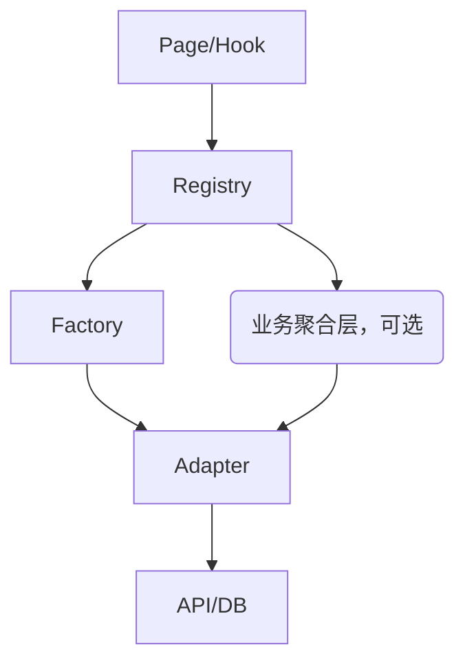

# 业务服务层（business）目录结构与最佳实践（2025修订）

本文件夹聚合了新架构下所有核心业务服务，采用统一的工厂（Factory）、适配器（Adapter）、接口（Interface）、自动降级（Auto Downgrade）等模式，支持多实现、可扩展、易测试。

---

## 目录结构说明

```
services/business/
├── app-service.ts           # 新架构统一入口服务（全局初始化/管理）
├── app-service-init.ts      # 入口初始化脚本及热更新逻辑
├── types.ts                 # 通用类型定义
├── <业务模块>/              # 如 user/match/messages/quiz 等
│   ├── adapters/            # 多种业务实现（mock/remote/hybrid/品牌定制等）
│   ├── factory/             # 工厂，负责实例创建和依赖注入
│   ├── registry/            # 注册表，支持多 provider 动态注册（强制启用，所有业务服务必须通过注册表获取实例，支持多实例/多 provider 场景）
│   ├── service/             # 聚合型/领域业务服务（可选）
│   ├── types/               # 类型接口定义
│   └── ...                  # 其它业务相关文件
├── phone/                   # 端能力适配与远程配置
├── tests/                   # 业务服务单元测试
```

---

## 2025 最新业务服务层设计规范

### 统一架构原则
- 所有业务服务（user/match/messages/quiz/notifications等）**必须通过注册表（Registry）获取实例**，禁止直接 new 或直接调用工厂。
- 注册表支持多 provider（mock/remote/hybrid/品牌定制）、多实例（default/品牌/租户等）灵活注册和切换，满足多租户、A/B 测试、品牌定制等场景。
- 工厂（Factory）仅负责实例创建与依赖注入，注册表负责实例生命周期和多实例管理。
- 适配器（Adapter）专注于底层数据访问/外部 API，服务接口（Service Interface）专注于业务聚合/编排。
- 所有类型接口（如 IMatchService/IMatchAdapter）集中在 types/，接口注释区分 adapter（数据/API 适配）与 service（业务聚合）。

### 推荐目录结构
```
services/business/
├── <业务模块>/
│   ├── adapters/            # mock/remote/hybrid/品牌定制等多种适配器
│   ├── factory/             # 工厂，负责实例创建
│   ├── registry/            # 注册表，强制所有服务实例通过此处获取
│   ├── service/             # 业务聚合/编排层（可选）
│   └── types/               # 统一接口（adapter/service分层）
```

### 典型用法
```typescript
// 注册服务实例（如入口初始化或切换环境）
MatchServiceRegistry.getInstance().createService('remote', 'default');
// 获取服务实例
const matchService = MatchServiceRegistry.getInstance().getService('remote', 'default');
```

### 设计规范要点
- hooks、service、页面等所有调用方**必须**通过注册表获取服务实例。
- 工厂方法外部禁止直接调用，仅注册表内部可用。
- 适配器构造参数统一，依赖均为可选（如 dataService?: IDataService），内部方法需校验依赖。
- 类型接口注释需区分 adapter/service 层，便于 mock/单测/扩展。
- 业务服务支持自动降级（如 NODE_ENV=development 自动切 mock）。

---

## 命名规范与注册表说明

### 1. Service Registry 统一命名
- 所有业务服务注册表统一命名为：`xxx-service-registry.ts`
  - 例如：`match-service-registry.ts`、`quiz-service-registry.ts`、`message-service-registry.ts`
- 主要职责：
  - 单例模式，统一管理/缓存/获取各业务服务实例（支持多类型、多实例、参数注入）。
  - 提供 `createService`、`getService`、`getProvider`、`clear` 等方法，便于 hooks/页面/业务层统一获取服务实例。

### 2. Provider/Adapter Registry 命名（如有必要）
- 若需底层适配器/工厂注册表，命名为：`xxx-adapter-registry.ts` 或 `xxx-provider-registry.ts`
  - 仅在底层有自定义适配器/工厂注册需求时使用。
  - 推荐将 provider 注册能力合并进 service-registry，避免重复维护。

### 3. 工厂 Factory 命名
- 所有业务工厂统一命名为：`xxx-service-factory.ts`
  - 例如：`match-service-factory.ts`、`quiz-service-factory.ts`
- 主要职责：
  - 负责实例化/适配/降级各类业务服务，不负责缓存。

### 4. 推荐用法
- 所有 hooks、页面、业务层统一通过 service-registry 获取服务实例，避免直接用工厂或底层 provider。
- 便于 mock/多环境切换/扩展/测试。

### 5. 目录结构建议
```
registry/
  match-service-registry.ts
  quiz-service-registry.ts
  message-service-registry.ts
factory/
  match-service-factory.ts
  quiz-service-factory.ts
  ...
```

---

如有特殊适配器/工厂注册场景，优先合并进 service-registry，保持命名和用法一致，便于团队协作和维护。

---

## 业务服务分层示意



---

（详细接口、注册表、工厂、适配器最佳实践见各业务模块 types/、registry/、factory/、adapters/ 子目录注释与实现）

---

## 统一工厂-注册表-适配器-接口-最佳实践

> **设计升级说明（2025）**：自本次重构起，业务服务层**强制启用注册表（registry）机制**，所有 hooks/service/业务入口必须通过注册表统一获取服务实例。注册表支持多实例、多 provider 动态注册与切换，满足多租户、A/B 测试、品牌定制等复杂场景。工厂负责实例创建，注册表负责实例生命周期与多实例管理。

### 1. 注册表（Registry）职责
- 所有业务服务实例必须通过注册表（如 `UserServiceRegistry`、`MatchServiceRegistry`）统一注册、获取与管理，禁止直接 new 或直接通过工厂获取。
- 注册表支持多实例（如 `default`、`brandA`、`tenantB`）、多 provider（mock/remote/hybrid/定制）动态注册与切换。
- 注册表负责实例生命周期管理、缓存复用、自动降级、依赖注入等。
- hooks 层、service 层、页面等所有调用方**必须**通过注册表获取服务实例。
- 典型用法：
  ```typescript
  // 注册服务实例（如在入口初始化或切换环境时）
  UserServiceRegistry.getInstance().createService('remote', apiBaseUrl, 'default');
  UserServiceRegistry.getInstance().createService('mock', undefined, 'test');
  // 获取服务实例
  const userService = UserServiceRegistry.getInstance().getService('remote', 'default');
  ```

### 2. 工厂（Factory）职责
- 工厂类（如 `UserServiceFactory`）负责实例的实际创建，封装依赖注入、provider 选择、自动降级等逻辑。
- 工厂方法签名统一，注册表内部调用工厂进行实例化，外部禁止直接调用工厂。

### 3. 适配器（Adapter）职责
- 每种类型（mock/remote/hybrid）均有独立适配器，全部实现统一的 Service Interface（如 `IMatchService`）。
- 适配器构造函数参数风格统一，依赖均为可选（如 `dataService?: IDataService`），内部方法需校验依赖。
- 适配器只关心自身数据来源和业务逻辑，不暴露外部依赖细节。

### 4. Service Interface 规范
- 所有业务服务均定义统一接口（如 `IMatchService`），上层调用只依赖接口，不关心具体实现。
- 典型接口示例：
  ```typescript
  export interface IMatchService {
    getUserMatches(userId: string): Promise<Match[]>;
    // ... 其他业务方法
  }
  ```

### 5. hooks 层实践
- hooks 层**必须通过注册表获取服务实例**，严禁直接 new/工厂调用，保证解耦、可测试和多 provider 场景兼容。

### 6. 目录结构与命名规范
- 每个业务模块分为 factory、adapters、types、service、api、worker 等子目录，保持分层清晰。
- 所有类型定义统一放在 types 子目录。

---

## 重要注意事项（2025修订）
- hooks/页面严禁直接实例化 Service/Adapter，必须通过注册表方法获取实例。
- 工厂方法签名、适配器参数风格、注册表机制保持全局统一，便于维护和扩展。
- 如遇特殊业务无 mock/remote/hybrid 类型，需说明原因并保持接口一致。
- 详细实现可参考 `match/factory/match-service-factory.ts` 与 `hooks/useMatches.ts`。