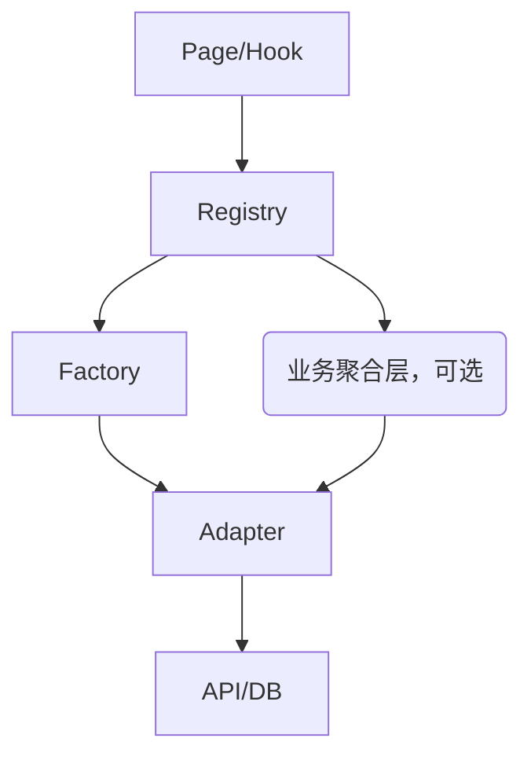

# 业务服务层（business）目录结构与最佳实践（2025修订）

本文件夹聚合了新架构下所有核心业务服务，采用统一的工厂（Factory）、适配器（Adapter）、接口（Interface）、自动降级（Auto Downgrade）等模式，支持多实现、可扩展、易测试。

---

## 目录结构说明

```
services/business/
├── app-service.ts           # 新架构统一入口服务（全局初始化/管理）
├── app-service-init.ts      # 入口初始化脚本及热更新逻辑
├── types.ts                 # 通用类型定义
├── <业务模块>/              # 如 user/match/messages/quiz 等
│   ├── adapters/            # 多种业务实现（mock/remote/hybrid/品牌定制等）
│   ├── factory/             # 工厂，负责实例创建和依赖注入
│   ├── registry/            # 注册表，支持多 provider 动态注册（强制启用，所有业务服务必须通过注册表获取实例，支持多实例/多 provider 场景）
│   ├── service/             # 聚合型/领域业务服务（可选）
│   ├── types/               # 类型接口定义
│   └── ...                  # 其它业务相关文件
├── phone/                   # 端能力适配与远程配置
├── tests/                   # 业务服务单元测试
```

---

## 统一插件化服务架构规范（2025修订）

为适应多品牌、多供应商、多算法、多类型等业务扩展需求，所有业务服务（包括 user/match/messages/quiz/notification 等）推荐采用**“注册表+工厂函数”插件化模式**，实现高度灵活、可插拔、易扩展的服务架构。

### 1. 适配器注册表与工厂函数模式
- 每个业务服务模块应包含一个 Factory 类，内部维护一个 `adapters` 注册表（Record<Type, FactoryFunction>）。
- 所有 Adapter（实现类）通过静态 `registerAdapter(type, factory)` 注册到 Factory。
- 通过 `getAdapter(type, options)` 获取对应类型的 Adapter 实例。
- `createService({ type, options, ... })` 统一从注册表获取 Adapter，实例化 Service。
- 支持运行时动态注册、第三方/业务方扩展、A/B 测试、Mock 注入等高级场景。

#### 推荐标准模板
```typescript
export class XxxServiceFactory {
  private static adapters: Record<XxxServiceType, (options?: XxxServiceOptions) => IXxxAdapter> = {};

  static registerAdapter(type: XxxServiceType, factory: (options?: XxxServiceOptions) => IXxxAdapter) {
    this.adapters[type] = factory;
  }

  static getAdapter(type: XxxServiceType, options?: XxxServiceOptions): IXxxAdapter | undefined {
    const factory = this.adapters[type];
    return factory ? factory(options) : undefined;
  }

  static createService({ type = 'mock', options = {} }: { type?: XxxServiceType, options?: XxxServiceOptions } = {}): IXxxService {
    this.registerAllAdapters();
    return new XxxService(type, options);
  }

  static registerAllAdapters() {
    this.registerAdapter('mock', () => new MockXxxAdapter());
    this.registerAdapter('remote', () => new RemoteXxxAdapter());
    // ...更多类型
  }
}
```

### 2. 服务注册表 getProvider 统一规范

所有 Registry 的 `getProvider` 方法应采用如下统一签名，保证 hooks 及服务层调用一致性：

```typescript
getProvider(
  type: string,         // mock/remote/hybrid/brandA/brandB/自定义类型等
  name?: string,        // 实例名，默认 'default'
  dataService?: any,    // 可选，部分服务如 Match 需注入数据服务
  options?: object      // 其它扩展参数，预留
): () => IService
```
- hooks 层/业务调用层**只能通过该接口获取服务实例**，严禁直接 Factory。
- 参数可选，不需要的传 undefined，内部自行判断。
- 支持多 provider、多实例、运行时扩展。

---

## 场景说明与最佳实践

- **端能力/多品牌/多算法/多供应商场景**（如 Camera、Bluetooth、NFC、Quiz、Match、Message、Notification 等）强烈建议采用插件化注册表模式。
- **业务实现单一、无扩展需求的服务**可保留 switch-case，但推荐统一注册表接口，便于后续扩展。
- **所有新服务/新适配器**请通过 Factory 的 registerAdapter 注册，严禁硬编码在 createService/switch-case 中。

---

其它目录结构、命名、接口等保持原有规范。

如需详细插件化示例或批量重构建议，请参考各业务模块的 factory/registry 实现。

---

## 命名规范与注册表说明

### 1. Service Registry 统一命名
- 所有业务服务注册表统一命名为：`xxx-service-registry.ts`
  - 例如：`match-service-registry.ts`、`quiz-service-registry.ts`、`message-service-registry.ts`
- 主要职责：
  - 单例模式，统一管理/缓存/获取各业务服务实例（支持多类型、多实例、参数注入）。
  - 提供 `createService`、`getService`、`getProvider`、`clear` 等方法，便于 hooks/页面/业务层统一获取服务实例。

### 2. Provider/Adapter Registry 命名（如有必要）
- 若需底层适配器/工厂注册表，命名为：`xxx-adapter-registry.ts` 或 `xxx-provider-registry.ts`
  - 仅在底层有自定义适配器/工厂注册需求时使用。
  - 推荐将 provider 注册能力合并进 service-registry，避免重复维护。

### 3. 工厂 Factory 命名
- 所有业务工厂统一命名为：`xxx-service-factory.ts`
  - 例如：`match-service-factory.ts`、`quiz-service-factory.ts`
- 主要职责：
  - 负责实例化/适配/降级各类业务服务，不负责缓存。

### 4. 推荐用法
- 所有 hooks、页面、业务层统一通过 service-registry 获取服务实例，避免直接用工厂或底层 provider。
- 便于 mock/多环境切换/扩展/测试。

### 5. 目录结构建议
```
registry/
  match-service-registry.ts
  quiz-service-registry.ts
  message-service-registry.ts
factory/
  match-service-factory.ts
  quiz-service-factory.ts
  ...
```

---

如有特殊适配器/工厂注册场景，优先合并进 service-registry，保持命名和用法一致，便于团队协作和维护。

---

## 业务服务分层示意



---

（详细接口、注册表、工厂、适配器最佳实践见各业务模块 types/、registry/、factory/、adapters/ 子目录注释与实现）

---

## 统一工厂-注册表-适配器-接口-最佳实践

> **设计升级说明（2025）**：自本次重构起，业务服务层**强制启用注册表（registry）机制**，所有 hooks/service/业务入口必须通过注册表统一获取服务实例。注册表支持多实例、多 provider 动态注册与切换，满足多租户、A/B 测试、品牌定制等复杂场景。工厂负责实例创建，注册表负责实例生命周期与多实例管理。

### 1. 注册表（Registry）职责
- 所有业务服务实例必须通过注册表（如 `UserServiceRegistry`、`MatchServiceRegistry`）统一注册、获取与管理，禁止直接 new 或直接通过工厂获取。
- 注册表支持多实例（如 `default`、`brandA`、`tenantB`）、多 provider（mock/remote/hybrid/定制）动态注册与切换。
- 注册表负责实例生命周期管理、缓存复用、自动降级、依赖注入等。
- hooks 层、service 层、页面等所有调用方**必须**通过注册表获取服务实例。
- 典型用法：
  ```typescript
  // 注册服务实例（如在入口初始化或切换环境时）
  UserServiceRegistry.getInstance().createService('remote', apiBaseUrl, 'default');
  UserServiceRegistry.getInstance().createService('mock', undefined, 'test');
  // 获取服务实例
  const userService = UserServiceRegistry.getInstance().getService('remote', 'default');
  ```

### 2. 工厂（Factory）职责
- 工厂类（如 `UserServiceFactory`）负责实例的实际创建，封装依赖注入、provider 选择、自动降级等逻辑。
- 工厂方法签名统一，注册表内部调用工厂进行实例化，外部禁止直接调用工厂。

### 3. 适配器（Adapter）职责
- 每种类型（mock/remote/hybrid）均有独立适配器，全部实现统一的 Service Interface（如 `IMatchService`）。
- 适配器构造函数参数风格统一，依赖均为可选（如 `dataService?: IDataService`），内部方法需校验依赖。
- 适配器只关心自身数据来源和业务逻辑，不暴露外部依赖细节。

### 4. Service Interface 规范
- 所有业务服务均定义统一接口（如 `IMatchService`），上层调用只依赖接口，不关心具体实现。
- 典型接口示例：
  ```typescript
  export interface IMatchService {
    getUserMatches(userId: string): Promise<Match[]>;
    // ... 其他业务方法
  }
  ```

### 5. hooks 层实践
- hooks 层**必须通过注册表获取服务实例**，严禁直接 new/工厂调用，保证解耦、可测试和多 provider 场景兼容。

### 6. 目录结构与命名规范
- 每个业务模块分为 factory、adapters、types、service、api、worker 等子目录，保持分层清晰。
- 所有类型定义统一放在 types 子目录。

---

## 重要注意事项（2025修订）
- hooks/页面严禁直接实例化 Service/Adapter，必须通过注册表方法获取实例。
- 工厂方法签名、适配器参数风格、注册表机制保持全局统一，便于维护和扩展。
- 如遇特殊业务无 mock/remote/hybrid 类型，需说明原因并保持接口一致。
- 详细实现可参考 `match/factory/match-service-factory.ts` 与 `hooks/useMatches.ts`.

---

## 业务服务体系设计说明

本目录下所有业务服务（如消息、用户、认证、支付、设备等）均采用统一的 provider/adapter/options 分层架构，便于多端适配、扩展与测试。

## 1. 设计分层概览

- **Provider**：主实现类型（如 remote、local、mock、web、capacitor、thirdparty 等），决定业务服务的运行环境或主后端。
- **Adapter**：具体实现 provider 的适配器，负责实际的 API 调用、数据处理等（如 RemoteMessageServiceAdapter、WebSensorAdapter）。
- **Options**：灵活扩展参数（如 brand、apiBaseUrl、featureFlag、环境变量等），用于 adapter 内部差异化处理。
- **Factory/Registry**：统一注册和获取服务实例，支持自动降级、mock 等。
- **Service/Hook**：业务调用层，页面/组件通过 hooks 获取服务实例，禁止直接 new。

## 2. 目录结构说明

每个业务服务目录结构建议如下：
```
adapters/    # 各种 provider/adapter 具体实现
factory/     # 工厂，注册所有 provider 实现
registry/    # 注册表，统一管理服务实例
service/     # 业务服务聚合层
hooks/       # 业务 hooks（如 useXxx）
types/       # 类型定义（ProviderType、Options、接口等）
```

## 3. 主要业务服务设计细节

### 消息服务（messages）
- 支持 remote/local/mock 多种 provider。
- RemoteMessageServiceAdapter 负责远程 API 交互，MockMessageServiceAdapter 用于测试。
- options 支持 apiBaseUrl、featureFlag 等。
- hooks/useMessages 统一获取实例，返回 loading/error/empty。

### 用户服务（user）
- 支持 remote/local/mock provider。
- RemoteUserAdapter 处理远程用户数据，LocalUserAdapter 支持离线。
- options 可扩展缓存策略、API 地址等。
- hooks/useUser 统一调用。

### 认证服务（auth）
- 支持 remote、mock、第三方登录等 provider。
- 适配器内部可根据 options 处理多种登录方式和环境。
- hooks/useAuth 统一调用。

### 支付服务（payment）
- 支持 stripe、wechat、mock 等 provider。
- options 支持支付渠道、回调地址等。
- hooks/usePayment 统一调用。

### 设备/传感器服务（phone/*）
- 如 sensor、nfc、camera、location、bluetooth 等均按 provider/adapter/options 分层。
- provider 如 web/capacitor/mock，options.brand 支持多品牌差异化。
- hooks/useSensor、useNFC 等统一调用。

### 其他服务（quiz、image、notifications、translation 等）
- 结构同上，支持多 provider/adapter，options 灵活扩展。

## 4. 统一调用与扩展范式

- 所有业务服务实例均通过工厂/注册表创建：
  ```ts
  const service = XxxServiceFactory.createService({
    type: 'remote',
    options: { apiBaseUrl: '/api/v1', brand: 'huawei' }
  });
  ```
- 推荐通过 hooks 获取服务实例：
  ```ts
  const { service, isLoading, error } = useXxxService({ provider: 'remote', brand: 'xiaomi' });
  ```
- 禁止页面/组件直接 new Adapter，避免耦合。
- 自动降级、mock、featureFlag、环境变量等全部通过 options 配置。

---
如需详细模板、最佳实践、或批量生成脚本，请参考各业务子目录 README 或联系维护者。