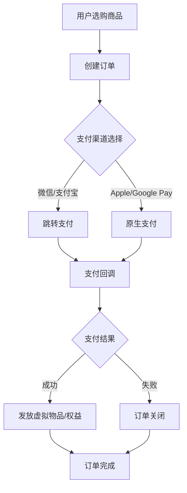
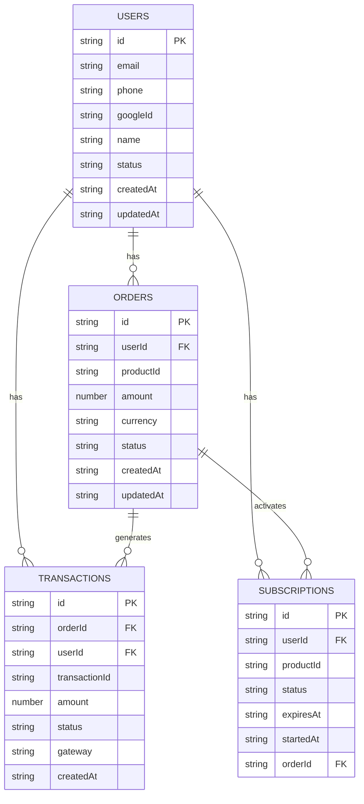

# 支付服务插件化架构与适配器注册说明

> 本文档描述 payment 模块插件式架构、适配器注册机制及业务最佳实践，适用于多渠道、多端、可扩展支付场景。

---

## 1. 插件式架构概览

- 所有支付服务实现均需继承统一接口 `IPaymentAdapter`（见 `@/core/services/infrastructure/payment/types/payment-service`）。
- 支持多种支付渠道（如 revenuecat、capacitor-purchases、stripe、wechat 等），可灵活扩展。
- 通过注册表 `PaymentServiceRegistry` 实现插件式适配器注册和动态获取。

---

## 2. 适配器注册与自动降级

- **批量注册内置适配器**：
  ```typescript
  import { PaymentServiceRegistry } from './registry/payment-service-registry';
  PaymentServiceRegistry.registerAllAdapters(); // 应用初始化时调用
  ```
- **自动降级机制**：
  - 支持通过环境变量 `NEXT_PUBLIC_PAYMENT_SERVICE_TYPE` 自动选择支付渠道。
  - 未设置时自动降级为 revenuecat。
  - 业务 hooks/usePayment 内部自动适配，无需手动切换。

---

## 3. 适配器实现规范

- 每个适配器需实现 `IPaymentAdapter` 接口：
  ```typescript
  import { IPaymentAdapter } from '@/core/services/infrastructure/payment/types/payment-service';
  export class StripePaymentService implements IPaymentAdapter {
    async initialize() {/* ... */}
    async getProducts() {/* ... */}
    async purchase(productId: string) {/* ... */}
    async getActiveSubscriptions() {/* ... */}
    async restorePurchases() {/* ... */}
    setConfig?(config: Record<string, any>) {/* 可选扩展 */}
  }
  ```
- 支持插件式注册和动态扩展。

---

## 4. 注册表用法

- 单例注册表，支持多类型多实例：
  ```typescript
  // 注册自定义适配器
  PaymentServiceRegistry.registerAdapter('custom', () => new CustomPaymentService());

  // 获取服务实例
  const service = PaymentServiceRegistry.getInstance().createService('stripe');
  ```
- 推荐所有适配器注册在应用入口统一调用 `registerAllAdapters()`。

---

## 5. 业务 hooks 调用

- 推荐所有页面/组件通过 hooks 获取服务实例，禁止直接 new/ServiceFactory。
  ```typescript
  const { products, loading, error, purchase } = usePayment();
  // usePayment 内部自动适配服务类型
  ```

---

## 6. 典型业务流程与数据结构

# 支付与商品类型设计

本模块用于梳理项目支付相关的商品类型、订阅模型与扩展建议，适用于相亲/社交/增值服务类App。

---

## 商品类型一览

### 1. 订阅类商品
- **年/月/周订阅**：周期性自动续费，解锁高级功能（如无限聊天、超级喜欢、隐身模式等）。
- 支持多种周期（年/月/周），可按需配置不同价格与权益。
- 推荐结合优惠券、首月折扣等促销策略。

### 2. 一次性虚拟物品
- **虚拟道具**：如超级喜欢、心动卡、聊天置顶、悄悄看等，仅在App内使用。
- **虚拟货币**：如金币、钻石，用户可充值后兑换道具。
- 适合提升活跃度与互动性。

### 3. 一次性实体物品
- **实物礼品**：如鲜花、巧克力、定制周边等，支持邮寄。
- 可作为互动奖励或活动奖品。

---

## 支付流程建议

1. 商品选购 → 订单创建 → 支付下单（微信/支付宝/Apple Pay/Google Pay等）
2. 支付回调校验 → 订单状态更新 → 虚拟物品/权益发放
3. 支持订单查询、退款、发票、账单等功能

---

## 典型业务流程图（示意）



---

## 关键数据结构建模（TypeScript示例）

```typescript
// 商品类型
export type ProductType = 'subscription' | 'virtual' | 'physical';

export interface Product {
  id: string;
  name: string;
  type: ProductType;
  price: number;
  duration?: number; // 订阅周期（天）
  extra?: any; // 扩展字段
}

// 订单
export interface Order {
  id: string;
  userId: string;
  productId: string;
  amount: number;
  status: 'pending' | 'paid' | 'failed' | 'refunded';
  createdAt: Date;
  paidAt?: Date;
  channel: 'wechat' | 'alipay' | 'apple' | 'google' | 'stripe';
  extra?: any;
}

// 支付回调
export interface PaymentCallback {
  orderId: string;
  status: 'success' | 'fail';
  channel: string;
  transactionId: string;
  paidAt: Date;
}
```

---

## 稳定且可扩展的用户-认证-订单/订阅/交易 Schema 设计

### 1. 核心表结构 TypeScript Schema

```typescript
// 用户表
export interface User {
  id: string; // 主键
  email?: string;
  phone?: string;
  googleId?: string;
  name?: string;
  status: 'active' | 'inactive' | 'banned';
  createdAt: string;
  updatedAt: string;
}

// 订单表
export interface Order {
  id: string; // 主键
  userId: string; // 外键
  productId: string;
  amount: number;
  currency: string;
  status: 'pending' | 'paid' | 'cancelled' | 'refunded';
  createdAt: string;
  updatedAt: string;
}

// 订阅表
export interface Subscription {
  id: string; // 主键
  userId: string; // 外键
  productId: string;
  status: 'active' | 'expired' | 'cancelled';
  expiresAt: string;
  startedAt: string;
  orderId: string; // 关联订单
}

// 交易表
export interface Transaction {
  id: string; // 主键
  orderId: string; // 外键
  userId: string; // 外键
  transactionId: string; // 第三方支付流水号
  amount: number;
  status: 'success' | 'failed' | 'pending';
  gateway: string; // 支付渠道
  createdAt: string;
}
```

### 2. 关系型数据库 E-R 架构图



> **说明：**
> - 用户与订单、订阅、交易均为一对多关系（userId 外键）。
> - 订单与交易、订阅均为一对多或一对一关系（orderId 外键）。
> - 订阅与订单通过 orderId 关联。
> - 交易与订单通过 orderId 关联。

### 3. 稳定性与扩展性建议
- 所有表均带 createdAt/updatedAt 字段，便于同步与历史追溯。
- 所有外键字段均加索引（如 userId, orderId），提升聚合与查询性能。
- 业务扩展如优惠券、分销、权益等可通过新增表并以 userId/orderId/transactionId 关联。
- 支持多支付渠道、多订阅类型、复杂业务逻辑。

---

## 订阅与购买如何与用户关联

在支付/订阅业务中，所有订单和权益都必须与用户唯一标识（userId/appUserId）强关联，确保数据安全和用户体验。

### 1. 唯一用户标识
- 每个用户有唯一 userId/appUserId，所有支付、订单、订阅均与此关联。
- 初始化 RevenueCat/Capacitor Purchases 时通过 `Purchases.configure({ apiKey, appUserID })` 绑定用户。
- 切换账号时调用 `Purchases.logIn(appUserID)`，确保 SDK 与后端同步。

### 2. 订单与用户关联表设计
- 订单表、订阅表需包含 userId 字段，所有支付行为都与用户强绑定。
- 示例结构：

```typescript
interface Order {
  orderId: string;
  userId: string;             // 关联用户
  productId: string;
  status: 'pending'|'success'|'failed';
  transactionId: string;
  amount: number;
  currency: string;
  createdAt: string;
  updatedAt: string;
  // ...其他业务字段
}
```

### 3. 客户端与服务端同步
- 客户端支付完成后，将 transactionId、productId、userId 等信息回传服务端，服务端校验并落库。
- 服务端以 userId 为主索引，确保所有订单/订阅都能查到归属用户。

### 4. 权益与用户实时绑定
- 用户所有权益（如会员等级、特权、积分等）均通过 userId 计算和分发。
- 订阅到期、自动续费、取消等事件需实时同步，更新用户权益状态。

### 5. 事件推送
- 结合消息/通知模块，按 userId 推送支付成功、订阅到期、权益变更等通知。

### 业务流程举例
1. 用户登录 → 获取 userId。
2. 客户端调用 `Purchases.configure({ ..., appUserID: userId })`。
3. 用户购买/订阅 → 完成后拿到 transactionId/productId。
4. 客户端将订单信息和 userId 上传到服务端。
5. 服务端校验并持久化订单，更新用户权益。
6. 后续所有订单、订阅、权益查询都以 userId 为主键。

---

## 用户、认证与购买订阅的关联实现

在本系统中，**用户（User）**、**认证（Auth）** 与 **购买/订阅（Order/Subscription/Transaction）** 的关联遵循如下设计原则：

### 1. 用户（User）是所有业务数据的主索引
- 每个用户拥有唯一 userId，所有认证、订单、订阅、权益等都与 userId 强关联。
- 用户信息通过 IUserService 及其适配器进行统一管理。

### 2. 认证（Auth）负责用户身份唯一性和安全
- 认证服务（如 Firebase）负责登录、注册，生成并维护 userId。
- 登录成功后返回 AuthUser（含 userId），后续所有资产、订单、订阅均以 userId 为主键。

### 3. 购买/订阅与用户的强绑定
- 所有订单（Order）、订阅（Subscription）、交易（Transaction）等表都包含 userId 字段，并通过外键关联 users 表。
- 支付/订阅完成后，客户端和服务端均以 userId 归集和查询所有资产。
- 用户的订阅状态、历史订单、当前权益等均可通过 userId 聚合查询。

### 4. 推荐的表结构关系

- **用户表（users）**：保存用户主数据。
- **订单表（orders）**：记录一次购买/下单行为，包含 userId、productId、amount、status 等。
- **订阅表（subscriptions）**：记录用户的订阅状态，包含 userId、productId、status、expiresAt 等。
- **交易表（transactions）**：记录每一次支付流水（如三方回调、退款、失败等），可包含 orderId、userId、transactionId、amount、status、gateway 等。

#### 示例结构：
```typescript
// 用户表
interface User {
  id: string;
  ...
}
// 订单表
interface Order {
  id: string;
  userId: string;
  productId: string;
  ...
}
// 订阅表
interface Subscription {
  id: string;
  userId: string;
  productId: string;
  status: 'active'|'expired'|'cancelled';
  expiresAt: string;
  ...
}
// 交易表
interface Transaction {
  id: string;
  orderId: string;
  userId: string;
  transactionId: string;
  amount: number;
  status: 'success'|'failed'|'pending';
  gateway: string;
  ...
}
```

### 5. 为什么要区分 Transaction、Order、Subscription？

- **Order（订单）** 表示一次下单行为，可能对应一次或多次支付（如分期、补差价等）。
- **Transaction（交易）** 记录每一笔实际的支付流水，包括支付成功、失败、退款等所有三方网关交互。
- **Subscription（订阅）** 记录用户的订阅状态、到期时间、续费情况等，通常和订单、交易有多对一、一对多关系。
- 区分有助于：
  - 精确追踪所有资金流、异常处理与风控
  - 支持复杂支付场景（如补单、退款、续费、分期等）
  - 便于统计分析、用户资产聚合与权益管理

### 6. 业务流程举例
1. 用户通过认证获得 userId。
2. 用户下单，生成 Order（orderId, userId, productId）。
3. 用户完成支付，每次支付生成一条 Transaction（transactionId, orderId, userId...）。
4. 若为订阅商品，创建/更新 Subscription（userId, productId, status, expiresAt...）。
5. 后续所有权益、统计、推送均以 userId 为主索引聚合。

---

## 技术实现建议

- 支持多渠道支付（微信、支付宝、Apple/Google、Stripe等）
- 商品、订单、支付、发放分层设计，便于扩展与维护
- 虚拟物品与实体物品分开建模，便于后续统计与风控
- 订阅到期自动续费、到期提醒、权益管理等需重点关注

---

## 业务扩展建议

- 商品、订单、支付、权益分层设计，便于后续对接不同支付渠道和风控系统
- 订单与用户、商品强关联，便于统计和用户资产管理
- 支持多币种、分区定价、促销活动等高级场景
- 可结合消息/通知模块，实现支付成功、订阅到期等事件推送

---

## 扩展方向

- 会员等级体系、成长值、积分商城
- 礼物排行榜、送礼互动、专属特权
- 结合AI推荐“最适合你的增值服务”

---

## 变更记录

- 2025-04-19
  - 支付模块全面插件化，适配器全部实现 IPaymentAdapter。
  - 批量注册能力合并至 PaymentServiceRegistry，支持 registerAllAdapters 一键注册。
  - hooks/usePayment 支持多渠道自动降级与类型安全。
  - 文档补充插件式架构与注册用法。

---

## 服务注册表 getProvider 统一规范

所有 Registry 的 `getProvider` 方法应采用如下统一签名：

```typescript
getProvider(
  type: string,         // mock/remote/hybrid/brandA/brandB 等服务类型
  name?: string,        // 实例名，默认 'default'
  dataService?: any,    // 可选，部分服务如 Match 需注入数据服务
  options?: object      // 其它扩展参数，预留
): () => IService
```

- 推荐统一调用体验，便于 hooks 泛型化和批量重构。
- 详见[服务架构统一规范](../../../../docs/guides/architecture/services/overview.md)。
